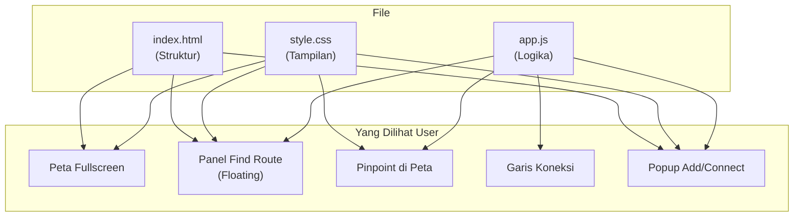
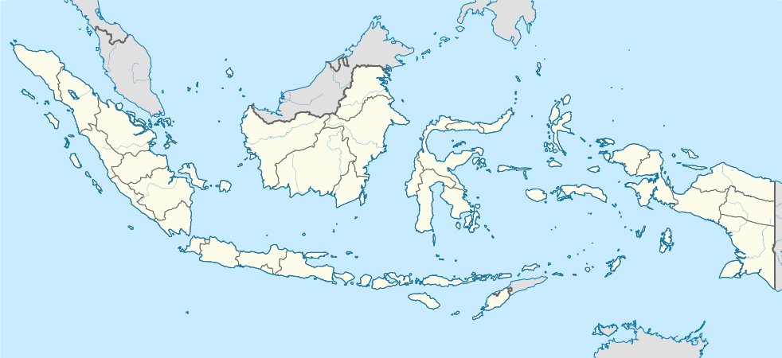
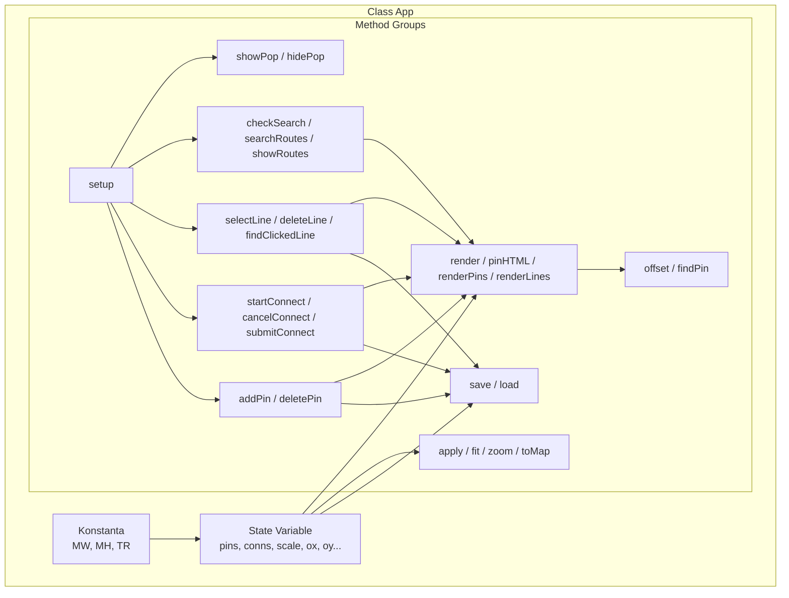
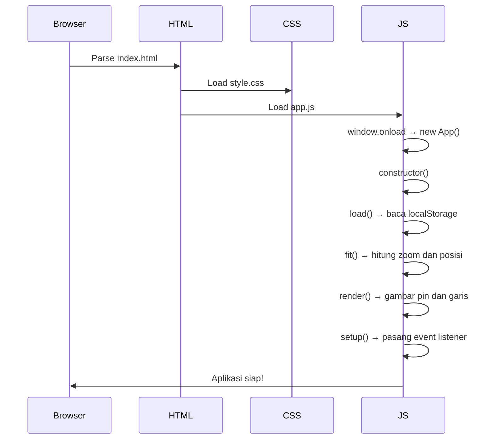
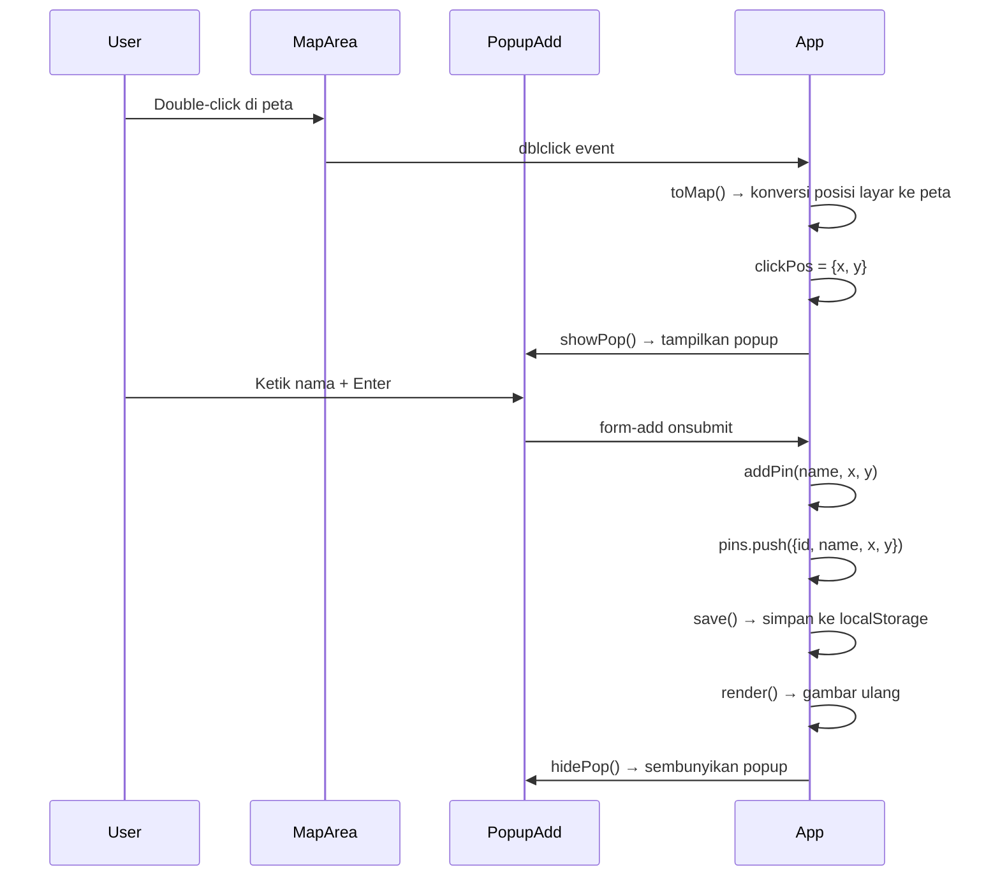
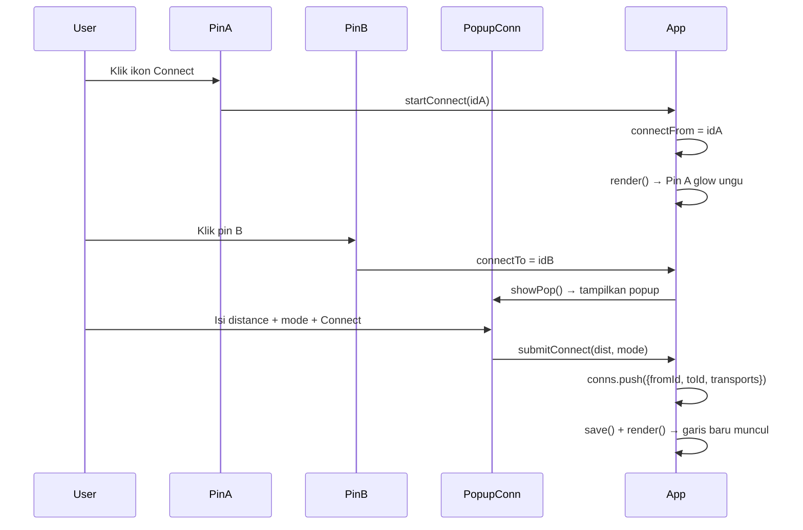
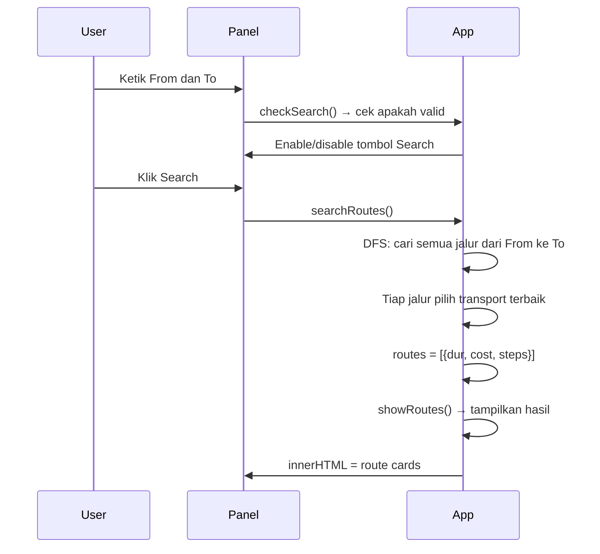
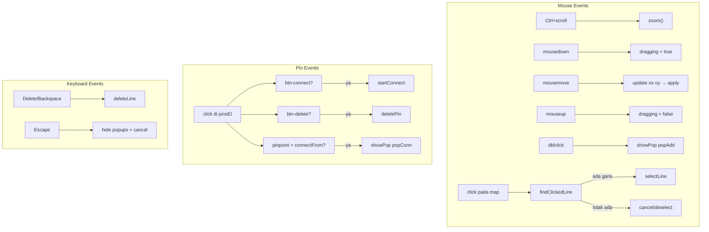

# 📚 PENJELASAN LENGKAP — Peta Interaktif Indonesia

> **Tujuan dokumen ini:** Agar kamu bisa **100% paham** seluruh kode dan bisa **menulis ulang tanpa mencontek**.
> Setiap variable, setiap fungsi, setiap rumus — semua dijelaskan di sini.

---

## 📋 DAFTAR ISI

1. [Gambaran Besar](#-1-gambaran-besar)
2. [Struktur File](#-2-struktur-file)
3. [Urutan Pembuatan Kode](#-3-urutan-pembuatan-kode)
4. [HTML — Penjelasan Lengkap](#-4-html--penjelasan-lengkap)
5. [CSS — Penjelasan Lengkap](#-5-css--penjelasan-lengkap)
6. [JavaScript — Penjelasan Lengkap](#-6-javascript--penjelasan-lengkap)
7. [Alur Kerja Aplikasi (Flow)](#-7-alur-kerja-aplikasi-flow)
8. [Penjelasan Setiap Variable](#-8-penjelasan-setiap-variable)
9. [Penjelasan Setiap Method/Fungsi](#-9-penjelasan-setiap-methodfungsi)
10. [Penjelasan Rumus Matematika](#-10-penjelasan-rumus-matematika)
11. [Koneksi CSS ↔ JS](#-11-koneksi-css--js)
12. [Event Flow (Alur Event)](#-12-event-flow-alur-event)
13. [Struktur Data](#-13-struktur-data)
14. [Tips Menghafal](#-14-tips-menghafal)

---

## 🌍 1. GAMBARAN BESAR

Aplikasi ini adalah **peta interaktif Indonesia** yang bisa:
- ✅ Zoom & pan (geser) peta
- ✅ Tambah pinpoint (titik lokasi) di peta
- ✅ Hubungkan 2 pinpoint dengan garis koneksi (train/bus/airplane)
- ✅ Pilih & hapus garis koneksi
- ✅ Cari rute dari titik A ke titik B

### Visualisasi Arsitektur



### Cara Kerja Singkat

```
User buka halaman
    ↓
HTML memuat struktur (peta, panel, popup)
    ↓
CSS membuat tampilan (warna, posisi, animasi)
    ↓
JS dijalankan → new App() → class App mulai bekerja
    ↓
App load data dari localStorage → gambar pin & garis → pasang event listener
    ↓
User berinteraksi (klik, double-klik, scroll, ketik)
    ↓
Event listener menangkap → panggil method yang sesuai → update tampilan
```

---

## 📂 2. STRUKTUR FILE

```
game7/
├── index.html              ← Struktur halaman (HTML)
├── style/
│   └── style.css           ← Tampilan & style (CSS)
├── js/
│   └── app.js              ← Seluruh logika dalam 1 class App (JS)
└── assets/                 ← Gambar & ikon
    ├── indonesia.svg       ← Gambar peta Indonesia
    ├── MaterialSymbolsLocationOn.svg       ← Ikon "From"
    ├── MaterialSymbolsLocationOnOutline.svg ← Ikon "To"
    ├── MdiTransitConnectionVariant.svg      ← Ikon Connect
    ├── MdiTrashCanOutline.svg               ← Ikon Hapus
    └── BiXLg.svg                            ← Ikon Close (×)
```

**Kenapa cuma 3 file utama?**
→ Supaya simpel. Semua logika JS cukup 1 file (class App). CSS 1 file. HTML 1 file.

---

## 🔨 3. URUTAN PEMBUATAN KODE

Kalau kamu mau bikin ini dari nol, urutannya begini:

### Tahap 1: HTML (Kerangka)
```
1. Buat struktur dasar (DOCTYPE, head, body)
2. Buat tombol toggle panel
3. Buat panel Find Route (input From, To, Search, Sort, Results)
4. Buat area peta (map-area > map-container > img + canvas + pinpoints-layer)
5. Buat popup Add Pinpoint
6. Buat popup Connect
7. Link ke CSS dan JS
```

### Tahap 2: CSS (Tampilan)
```
1. Reset (* { margin:0; padding:0; box-sizing:border-box })
2. Body fullscreen (width:100%, height:100%, overflow:hidden)
3. Style tombol toggle (fixed, z-index tinggi)
4. Style panel floating (fixed, rounded, shadow, display:none/.open)
5. Style input group, search button, sort buttons, route cards
6. Style map-area fullscreen (fixed, left:0, top:0, right:0, bottom:0)
7. Style map-container (absolute, transform-origin:0 0)
8. Style canvas & pinpoints-layer (absolute, top:0, left:0)
9. Style pinpoint (absolute, transform:translate(-50%,-100%))
10. Style pinpoint-label (flex, background putih, border, shadow)
11. Style connecting state (glow animation)
12. Style popup (fixed, z-index:300, background putih)
13. Style form dalam popup
```

### Tahap 3: JavaScript (Logika)
```
1. Buat class App dengan konstanta (MW, MH, TR)
2. Constructor: state variables + ambil elemen DOM + jalankan
3. Buat save() dan load() untuk localStorage
4. Buat apply(), fit(), zoom(), toMap() untuk transform
5. Buat render(), pinHTML(), renderPins(), renderLines() untuk gambar
6. Buat offset() dan findPin() helper
7. Buat addPin(), deletePin() untuk pinpoint
8. Buat startConnect(), cancelConnect(), submitConnect() untuk koneksi
9. Buat selectLine(), deleteLine(), findClickedLine() untuk garis
10. Buat checkSearch(), searchRoutes(), showRoutes() untuk cari rute
11. Buat showPop(), hidePop() untuk popup
12. Buat setup() dengan SEMUA event listener
13. window.onload = function() { new App(); }
```

---

## 🏗️ 4. HTML — PENJELASAN LENGKAP

### 4.1 Bagian Head

```html
<!DOCTYPE html>
<html lang="id">
<head>
    <meta charset="UTF-8">
    <meta name="viewport" content="width=device-width, initial-scale=1.0">
    <title>Peta Interaktif Indonesia</title>
    <link rel="stylesheet" href="style/style.css">
</head>
```

| Baris | Penjelasan |
|-------|------------|
| `<!DOCTYPE html>` | Memberitahu browser bahwa ini HTML5 |
| `<html lang="id">` | Bahasa Indonesia |
| `<meta charset="UTF-8">` | Supaya karakter Indonesia (é, ü, dll) tampil benar |
| `<meta name="viewport" ...>` | Supaya responsif di HP/tablet |
| `<title>` | Judul tab browser |
| `<link rel="stylesheet" ...>` | Menghubungkan CSS ke HTML |

---

### 4.2 Tombol Toggle Panel

```html
<button id="btn-toggle">☰ Route</button>
```

**Apa ini?** Tombol di pojok kiri atas untuk buka/tutup panel Find Route.

**Kenapa pakai `id`?** Supaya JS bisa akses tombol ini lewat `document.getElementById('btn-toggle')`.

**Koneksi ke JS:**
```javascript
// Di constructor:
this.btnToggle = $('btn-toggle');

// Di setup():
this.btnToggle.onclick = function () { self.panel.classList.toggle('open'); };
```

**Koneksi ke CSS:**
```css
#btn-toggle {
    position: fixed;   /* Selalu di posisi yang sama saat scroll */
    top: 14px;         /* 14px dari atas */
    left: 14px;        /* 14px dari kiri */
    z-index: 300;      /* Di atas segalanya */
}
```

---

### 4.3 Panel Find Route

```html
<div id="route-panel" class="open">
    <h2>Find Route</h2>

    <div class="input-group">
        
        <input type="text" id="input-from" placeholder="From" autocomplete="off">
    </div>

    <div class="input-group">
        
        <input type="text" id="input-to" placeholder="To" autocomplete="off">
    </div>

    <button id="btn-search" disabled>Search</button>

    <div id="sort-controls" class="hidden">
        <span>Sort by:</span>
        <button class="sort-btn active" data-sort="fastest">Fastest</button>
        <button class="sort-btn" data-sort="cheapest">Cheapest</button>
    </div>

    <div id="route-results"></div>
</div>
```

**Penjelasan setiap bagian:**

| Elemen | Fungsi | ID/Class | Diakses di JS |
|--------|--------|----------|---------------|
| `<div id="route-panel" class="open">` | Container panel, `class="open"` = panel terbuka saat awal | `#route-panel` | `this.panel` |
| `<h2>Find Route</h2>` | Judul panel | — | — |
| `<div class="input-group">` | Wrapper untuk icon + input | `.input-group` | — |
| `<input id="input-from">` | Input kota asal | `#input-from` | `this.inFrom` |
| `<input id="input-to">` | Input kota tujuan | `#input-to` | `this.inTo` |
| `<button id="btn-search" disabled>` | Tombol search (awalnya disabled) | `#btn-search` | `this.btnSearch` |
| `<div id="sort-controls" class="hidden">` | Tombol sort (awalnya tersembunyi) | `#sort-controls` | `this.sortCtrl` |
| `data-sort="fastest"` | Data attribute untuk tahu tombol sort mana yang diklik | — | `this.getAttribute('data-sort')` |
| `<div id="route-results">` | Tempat menampilkan hasil rute | `#route-results` | `this.results` |

**Kenapa `autocomplete="off"`?**
→ Supaya browser tidak tampilkan saran autocomplete yang mengganggu.

**Kenapa `disabled` di tombol search?**
→ Supaya user tidak bisa klik sebelum mengisi From dan To yang valid.

**Kenapa `class="hidden"` di sort-controls?**
→ Supaya tombol sort baru tampil setelah search dijalankan.

---

### 4.4 Area Peta

```html
<main id="map-area">
    <div id="map-container">
        
        <canvas id="lines-layer"></canvas>
        <div id="pinpoints-layer"></div>
    </div>
</main>
```

**Ini adalah "otak" dari peta.** Mari kita visualisasikan layer-nya:

```
┌──────────────────────────────── map-area (fullscreen, fixed) ──┐
│                                                                 │
│  ┌──────────────────── map-container (di-transform) ──────┐    │
│  │                                                         │    │
│  │  ┌─── Layer 1: map-img (gambar peta Indonesia) ──┐     │    │
│  │  │   indonesia.svg                                 │     │    │
│  │  └─────────────────────────────────────────────────┘     │    │
│  │                                                         │    │
│  │  ┌─── Layer 2: canvas (garis koneksi) ────────────┐    │    │
│  │  │   Garis hijau, ungu, hitam                      │    │    │
│  │  └─────────────────────────────────────────────────┘    │    │
│  │                                                         │    │
│  │  ┌─── Layer 3: pinpoints-layer (titik lokasi) ───┐    │    │
│  │  │   Pin Jakarta, Pin Surabaya, dll                │    │    │
│  │  └─────────────────────────────────────────────────┘    │    │
│  │                                                         │    │
│  └─────────────────────────────────────────────────────────┘    │
│                                                                 │
└─────────────────────────────────────────────────────────────────┘
```

**Penjelasan setiap elemen:**

| Elemen | Fungsi | Kenapa? |
|--------|--------|---------|
| `<main id="map-area">` | Area yang bisa di-pan dan di-zoom | `position:fixed` = menutupi seluruh layar. Event mouse ditangkap di sini |
| `<div id="map-container">` | Wadah yang di-transform (zoom + geser) | `transform-origin: 0 0` + CSS `transform` dari JS = zoom & pan |
| `` | Gambar peta Indonesia (SVG) | `draggable="false"` = supaya gambar tidak bisa di-drag browser |
| `<canvas id="lines-layer">` | Canvas untuk gambar garis koneksi | `pointer-events: none` = klik tembus ke bawah, garis digambar pakai JS |
| `<div id="pinpoints-layer">` | Container untuk semua pinpoint | `pointer-events: none` tapi pinpoint individual punya `pointer-events: auto` |

**Kenapa 3 layer terpisah?**
```
Layer 1 (paling bawah) : Gambar peta     → selalu ada, tidak berubah
Layer 2 (tengah)        : Canvas garis    → digambar ulang tiap ada perubahan koneksi
Layer 3 (paling atas)   : Pinpoint        → di-render ulang tiap ada perubahan pin
```

**Kenapa `pointer-events: none` di canvas dan pinpoints-layer?**
→ Supaya klik di area kosong (antara pin) tembus ke map-area (untuk pan dan dblclick).
→ Tapi setiap pinpoint dikasih `pointer-events: auto` supaya bisa diklik.

---

### 4.5 Popup Add Pinpoint

```html
<div id="popup-add" class="popup hidden">
    <div class="popup-header">
        <span>Add pinpoint</span>
        
    </div>
    <form id="form-add">
        <input type="text" id="input-name" placeholder="Enter location name" required autocomplete="off">
    </form>
</div>
```

**Kapan muncul?** Saat user **double-click** di area peta.

**Alur:**
```
User double-click di peta
    ↓
JS menangkap event → hitung posisi di peta
    ↓
Popup muncul di dekat kursor → user ketik nama → tekan Enter
    ↓
JS buat pinpoint baru → simpan ke localStorage → render ulang
```

**Kenapa pakai `<form>`?**
→ Supaya bisa pakai event `onsubmit` dan user bisa tekan Enter untuk submit (tanpa perlu tombol).

**Kenapa `required`?**
→ HTML validation bawaan: form tidak bisa di-submit kalau input kosong.

---

### 4.6 Popup Connect

```html
<div id="popup-connect" class="popup hidden">
    <div class="popup-header">
        <span>Connect</span>
        
    </div>
    <form id="form-connect">
        <input type="number" id="input-distance" placeholder="Distance (km)" required min="1" autocomplete="off">
        <select id="input-mode" required>
            <option value="">Select transport</option>
            <option value="train">Train</option>
            <option value="bus">Bus</option>
            <option value="airplane">Airplane</option>
        </select>
        <button type="submit">Connect</button>
    </form>
</div>
```

**Kapan muncul?** Saat user dalam mode connecting dan klik pinpoint tujuan.

**Alur lengkap:**
```
User klik ikon Connect di pin A → pin A glow ungu (mode connecting)
    ↓
User klik pin B → popup Connect muncul
    ↓
User isi jarak + pilih transport → klik Connect / tekan Enter
    ↓
JS buat koneksi baru → simpan → gambar garis di canvas
```

---

### 4.7 Script Tag

```html
<script src="js/app.js"></script>
```

**Kenapa di bawah body content (sebelum `</body>`)?**
→ Supaya seluruh HTML sudah ter-load sebelum JS dijalankan. Kalau taruh di `<head>`, elemen HTML belum ada dan `document.getElementById` akan return `null`.

---

## 🎨 5. CSS — PENJELASAN LENGKAP

### 5.1 Reset & Base

```css
* {
    margin: 0;
    padding: 0;
    box-sizing: border-box;
}
```

**Apa ini?**
- `*` = semua elemen HTML
- `margin: 0; padding: 0` = hapus jarak bawaan browser (setiap browser punya default margin/padding berbeda)
- `box-sizing: border-box` = ukuran elemen termasuk padding dan border (kalau tidak, padding menambah ukuran)

**Contoh perbedaan box-sizing:**
```
content-box (default):
┌──────────────────── 200px + 20px padding = 220px total ─┐
│  padding  ┌──────── 200px konten ──────┐  padding       │
│  10px     │                             │  10px          │
│           └─────────────────────────────┘                │
└──────────────────────────────────────────────────────────┘

border-box (yang kita pakai):
┌──────────────────── 200px total ────────────────────────┐
│  padding  ┌──────── 180px konten ──────┐  padding       │
│  10px     │                             │  10px          │
│           └─────────────────────────────┘                │
└──────────────────────────────────────────────────────────┘
```

```css
html, body {
    width: 100%;
    height: 100%;
    overflow: hidden;
    font-family: 'Segoe UI', Arial, sans-serif;
    background: #C8EBFF;
}
```

| Property | Penjelasan |
|----------|------------|
| `width: 100%; height: 100%` | Isi seluruh layar |
| `overflow: hidden` | Konten yang keluar dari layar disembunyikan (peta kita handle zoom/pan sendiri) |
| `font-family` | Font utama. Kalau Segoe UI tidak ada, pakai Arial. Kalau Arial tidak ada, pakai sans-serif |
| `background: #C8EBFF` | Warna biru muda sebagai latar belakang |

---

### 5.2 Tombol Toggle

```css
#btn-toggle {
    position: fixed;        /* Tetap di posisi yang sama saat scroll */
    top: 14px;              /* 14px dari atas layar */
    left: 14px;             /* 14px dari kiri layar */
    z-index: 300;           /* Paling atas (di atas panel) */
    padding: 8px 16px;      /* 8px atas-bawah, 16px kiri-kanan */
    background: #7B2FF2;    /* Warna ungu */
    color: white;
    border: none;           /* Hapus border default button */
    border-radius: 8px;     /* Sudut membulat */
    font-size: 14px;
    font-weight: 600;       /* Semi-bold */
    cursor: pointer;        /* Kursor tangan saat hover */
    box-shadow: 0 2px 8px rgba(123, 47, 242, 0.35);  /* Bayangan ungu */
    transition: background 0.2s;  /* Animasi halus saat hover */
}

#btn-toggle:hover {
    background: #6320d0;    /* Ungu lebih gelap saat hover */
}
```

**Kenapa `position: fixed`?**
→ Supaya tombol selalu di pojok kiri atas, tidak ikut bergerak saat peta di-pan.

**Kenapa `z-index: 300`?**
→ Z-index menentukan urutan tumpukan. Semakin besar angkanya, semakin di atas.
```
z-index: 300  → Tombol toggle & popup (paling atas)
z-index: 250  → Panel Find Route
z-index: 50   → Pinpoint
z-index: 1    → Peta (paling bawah)
```

---

### 5.3 Panel Find Route

```css
#route-panel {
    position: fixed;
    left: 14px;
    top: 56px;                          /* Di bawah tombol toggle */
    width: 280px;
    max-height: calc(100vh - 70px);     /* Maksimal tinggi = tinggi layar - 70px */
    background: #fff;
    z-index: 250;                       /* Di bawah tombol toggle */
    padding: 16px;
    border-radius: 12px;               /* Sudut membulat → kesan mengapung */
    box-shadow: 0 4px 20px rgba(0, 0, 0, 0.15);  /* Bayangan lembut */
    overflow-y: auto;                   /* Scroll kalau konten terlalu panjang */
    display: none;                      /* Default: tersembunyi */
    flex-direction: column;
    gap: 12px;                          /* Jarak antar elemen di dalam panel */
}

#route-panel.open {
    display: flex;                      /* Tampil kalau ada class "open" */
}
```

**Konsep penting: `display: none` vs `display: flex`**
```
display: none   → Elemen HILANG total, tidak kelihatan, tidak mengambil ruang
display: flex   → Elemen TAMPIL, anak-anaknya diatur vertikal (flex-direction: column)
```

**Kenapa `calc(100vh - 70px)`?**
→ `100vh` = 100% tinggi viewport (layar). Dikurangi 70px supaya panel tidak terlalu panjang dan ada ruang untuk tombol toggle di atasnya.

**Bagaimana cara toggle?**
```
Saat user klik tombol "☰ Route":
    ↓
JS: self.panel.classList.toggle('open')
    ↓
Kalau panel PUNYA class "open" → hapus class → display: none → SEMBUNYI
Kalau panel TIDAK PUNYA class "open" → tambah class → display: flex → TAMPIL
```

---

### 5.4 Input Group

```css
.input-group {
    display: flex;              /* Ikon dan input bersebelahan */
    align-items: center;        /* Sejajar vertikal di tengah */
    gap: 8px;                   /* Jarak antara ikon dan input */
    border: 1.5px solid #ccc;  /* Border abu-abu */
    border-radius: 6px;
    padding: 6px 10px;
}

.input-group img {
    width: 20px;
    height: 20px;
    flex-shrink: 0;             /* Ikon TIDAK mengecil saat ruang sempit */
}

.input-group input {
    border: none;               /* Hapus border default input */
    outline: none;              /* Hapus outline saat focus */
    flex: 1;                    /* Input MENGISI sisa ruang yang ada */
    font-size: 14px;
    width: 100%;
}
```

**Visualisasi layout flex:**
```
┌─── .input-group (display: flex) ────────────────┐
│                                                   │
│  ┌───────┐  ┌──────────────────────────────────┐ │
│  │  IMG  │  │         INPUT (flex: 1)           │ │
│  │ 20×20 │  │    → mengisi sisa ruang           │ │
│  └───────┘  └──────────────────────────────────┘ │
│                                                   │
│  ←─ gap: 8px ─→                                  │
└───────────────────────────────────────────────────┘
```

---

### 5.5 Tombol Search

```css
#btn-search {
    width: 100%;                /* Lebar penuh */
    padding: 10px;
    background: #7B2FF2;       /* Ungu */
    color: white;
    border: none;
    border-radius: 6px;
    font-size: 14px;
    font-weight: 600;
    cursor: pointer;
    transition: background 0.2s;
}

#btn-search:hover:not(:disabled) {
    background: #6320d0;       /* Lebih gelap saat hover, HANYA kalau tidak disabled */
}

#btn-search:disabled {
    background: #ccc;          /* Abu-abu saat disabled */
    cursor: not-allowed;       /* Kursor "dilarang" */
}
```

**Kenapa `:hover:not(:disabled)`?**
→ Tanpa `:not(:disabled)`, tombol yang disabled tetap berubah warna saat hover, yang membingungkan user.

**Kapan disabled / enabled?**
```
JS: checkSearch() → cek apakah From dan To diisi dengan nama pin yang valid
    ↓
Kalau valid: this.btnSearch.disabled = false  → tombol ungu, bisa diklik
Kalau tidak: this.btnSearch.disabled = true   → tombol abu-abu, tidak bisa diklik
```

---

### 5.6 Area Peta

```css
#map-area {
    position: fixed;
    left: 0;
    top: 0;
    right: 0;
    bottom: 0;                 /* 4 sisi = 0 → FULLSCREEN */
    overflow: hidden;          /* Konten di luar area disembunyikan */
    background: #C8EBFF;       /* Biru muda (warna laut) */
    cursor: grab;              /* Kursor tangan terbuka → "bisa di-drag" */
}

#map-area.dragging {
    cursor: grabbing;          /* Kursor tangan menggenggam → "sedang di-drag" */
}
```

**Kenapa `left:0; top:0; right:0; bottom:0`?**
→ Ini cara membuat elemen mengisi SELURUH layar dengan `position: fixed`.
→ Sama dengan `width: 100vw; height: 100vh` tapi lebih reliable.

```css
#map-container {
    position: absolute;
    transform-origin: 0 0;     /* Titik asal transform di pojok kiri atas */
}
```

**Kenapa `transform-origin: 0 0`?**
→ Saat zoom, transform dimulai dari pojok kiri atas. Ini mempermudah perhitungan zoom di JS.
→ Default-nya `50% 50%` (tengah), tapi itu bikin perhitungan lebih rumit.

```css
#map-img {
    display: block;            /* Hapus gap bawah default  (inline) */
    user-select: none;         /* Tidak bisa di-select (highlight biru) */
    -webkit-user-drag: none;   /* Tidak bisa di-drag (khusus Chrome/Safari) */
}
```

**Kenapa `display: block`?**
→ Default `` adalah `inline`, yang menambah gap kecil di bawah gambar. `block` menghapus gap ini.

---

### 5.7 Canvas & Pinpoints Layer

```css
#lines-layer {
    position: absolute;
    top: 0;
    left: 0;
    pointer-events: none;      /* Klik TEMBUS ke layer di bawahnya */
}

#pinpoints-layer {
    position: absolute;
    top: 0;
    left: 0;
    pointer-events: none;      /* Klik TEMBUS, tapi... */
}
```

**Konsep penting: `pointer-events`**
```
pointer-events: none   → Elemen "transparan" untuk mouse. Klik menembus ke bawah.
pointer-events: auto   → Normal, elemen bisa diklik.

Kenapa pinpoints-layer = none?
→ Supaya klik di area kosong (antara pin) tembus ke map-area.
→ Tapi setiap pinpoint dikasih pointer-events: auto jadi PIN-nya bisa diklik.
```

---

### 5.8 Pinpoint

```css
.pinpoint {
    position: absolute;
    transform: translate(-50%, -100%);  /* Posisikan ujung bawah pin tepat di koordinat */
    z-index: 50;
    display: flex;
    flex-direction: column;
    align-items: center;
    cursor: pointer;
    pointer-events: auto;               /* Bisa diklik (override parent none) */
}
```

**Kenapa `transform: translate(-50%, -100%)`?**
→ Ini supaya UJUNG BAWAH pin yang berada di koordinat yang ditentukan.

```
Tanpa translate:                  Dengan translate(-50%, -100%):

  ┌──────┐                          ┌──────┐
  │ Label │                          │ Label │
  └──────┘                          └──────┘
  📍 ← pin di sini                      📍
  X──── titik koordinat              ──X── titik koordinat tepat di ujung bawah
```

---

### 5.9 Animasi Glow (Connecting Mode)

```css
.pinpoint-label.connecting {
    border-color: #7B2FF2;            /* Border ungu */
    background: #EDE7F6;              /* Background ungu muda */
    box-shadow: 0 0 8px rgba(123, 47, 242, 0.5);
    animation: glow 1s infinite alternate;  /* Animasi glow terus-menerus */
}

@keyframes glow {
    from { box-shadow: 0 0 4px rgba(123, 47, 242, 0.4); }   /* Glow kecil */
    to   { box-shadow: 0 0 14px rgba(123, 47, 242, 0.9); }  /* Glow besar */
}
```

**Cara kerja animasi:**
```
Detik 0:   box-shadow kecil (4px, opacity 0.4)    → redup
Detik 0.5: box-shadow medium                      → sedang
Detik 1:   box-shadow besar (14px, opacity 0.9)   → terang
Detik 1.5: box-shadow medium                      → sedang (alternate = balik)
Detik 2:   box-shadow kecil                        → redup  (ulangi)
... terus berulang (infinite)
```

**Kapan class "connecting" ditambahkan?**
→ Di `pinHTML()`:
```javascript
var cls = this.connectFrom === p.id ? ' connecting' : '';
// Kalau pin ini sedang dalam mode connecting → tambah class "connecting"
```

---

### 5.10 Popup

```css
.popup {
    position: fixed;
    z-index: 300;              /* Paling atas (sama dengan tombol toggle) */
    background: #fff;
    border-radius: 8px;
    padding: 12px 16px;
    box-shadow: 0 4px 16px rgba(0, 0, 0, 0.2);
    border: 1.5px solid #ddd;
    min-width: 200px;          /* Minimal lebar 200px */
}

.popup.hidden {
    display: none;             /* Sembunyi kalau ada class "hidden" */
}
```

**Cara show/hide popup dari JS:**
```javascript
showPop(el, e) {
    el.style.left = (e.clientX + 10) + 'px';  // 10px di kanan kursor
    el.style.top = (e.clientY - 10) + 'px';   // 10px di atas kursor
    el.classList.remove('hidden');              // Hapus class "hidden" → tampil
}

hidePop(el) {
    el.classList.add('hidden');                 // Tambah class "hidden" → sembunyi
}
```

---

## ⚡ 6. JAVASCRIPT — PENJELASAN LENGKAP

### 6.1 Struktur Keseluruhan



---

### 6.2 Konstanta

```javascript
class App {
    static MW = 982;    // Map Width = lebar asli gambar peta (pixel)
    static MH = 450;    // Map Height = tinggi asli gambar peta (pixel)
```

**Kenapa `static`?**
→ `static` berarti konstanta ini milik CLASS, bukan milik instance. Diakses dengan `App.MW` bukan `this.MW`.

**Kenapa 982 × 450?**
→ Ini ukuran asli dari file `indonesia.svg`. Semua koordinat pin (x, y) mengacu pada ukuran ini.

```javascript
    static TR = {
        train: { color: '#33E339', speed: 120, cost: 500, label: 'Train' },
        bus: { color: '#A83BE8', speed: 80, cost: 100, label: 'Bus' },
        airplane: { color: '#000000', speed: 800, cost: 1000, label: 'Airplane' }
    };
```

**TR = Transport Reference** — data tentang setiap jenis transport:

| Properti | Train | Bus | Airplane | Penjelasan |
|----------|-------|-----|----------|------------|
| `color` | Hijau | Ungu | Hitam | Warna garis di canvas |
| `speed` | 120 | 80 | 800 | Kecepatan km/jam (buat hitung durasi) |
| `cost` | 500 | 100 | 1000 | Biaya per km (buat hitung harga) |
| `label` | Train | Bus | Airplane | Teks yang ditampilkan |

**Cara pakai:**
```javascript
var cfg = App.TR['train'];
// cfg.color  = '#33E339'
// cfg.speed  = 120
// cfg.cost   = 500

var durasi = 240 / cfg.speed;  // 240km / 120km/jam = 2 jam
var biaya = 240 * cfg.cost;    // 240km × 500 = Rp120.000
```

---

### 6.3 Constructor (Semua Variable State)

```javascript
constructor() {
    this.pins = [];            // Array semua pinpoint
    this.conns = [];           // Array semua koneksi
    this.scale = 1;            // Zoom level (1 = normal, 2 = 2x zoom)
    this.ox = 0;               // Offset X (geser horizontal)
    this.oy = 0;               // Offset Y (geser vertikal)
    this.dragging = false;     // Apakah sedang di-drag?
    this.dragX = 0;            // Posisi X mouse saat mulai drag
    this.dragY = 0;            // Posisi Y mouse saat mulai drag
    this.sox = 0;              // Start Offset X (ox saat mulai drag)
    this.soy = 0;              // Start Offset Y (oy saat mulai drag)
    this.connectFrom = null;   // ID pin asal (mode connecting)
    this.connectTo = null;     // ID pin tujuan (mode connecting)
    this.selectedLine = null;  // ID garis yang sedang dipilih
    this.clickPos = {};        // Posisi klik terakhir di peta (untuk add pin)
    this.sortMode = 'fastest'; // Mode sortir: 'fastest' atau 'cheapest'
    this.routes = [];          // Hasil pencarian rute
```

**Visualisasi State:**
```
pins = [
    { id: 'p123', name: 'Jakarta',  x: 155, y: 280 },
    { id: 'p456', name: 'Surabaya', x: 280, y: 265 }
]

conns = [
    {
        id: 'c789',
        fromId: 'p123',           ← Dari Jakarta
        toId: 'p456',             ← Ke Surabaya
        transports: [
            { mode: 'train', distance: 732 },    ← Train 732km
            { mode: 'airplane', distance: 660 }  ← Airplane 660km
        ]
    }
]

scale = 1.5        ← Zoom 1.5x
ox = -100          ← Peta digeser 100px ke kiri
oy = -50           ← Peta digeser 50px ke atas
```

---

### 6.4 Ambil Elemen DOM

```javascript
    var $ = function (id) { return document.getElementById(id); };
```

**Apa ini?** Shortcut supaya tidak menulis `document.getElementById('xxx')` berulang-ulang.

```javascript
    this.area = $('map-area');           // <main id="map-area">
    this.container = $('map-container'); // <div id="map-container">
    this.canvas = $('lines-layer');      // <canvas id="lines-layer">
    this.ctx = this.canvas.getContext('2d');  // Context 2D untuk gambar di canvas
    this.pinsEl = $('pinpoints-layer');  // <div id="pinpoints-layer">
    this.popAdd = $('popup-add');        // Popup add pinpoint
    this.popConn = $('popup-connect');   // Popup connect
    this.inName = $('input-name');       // Input nama pinpoint
    this.inDist = $('input-distance');   // Input jarak
    this.inMode = $('input-mode');       // Select transport mode
    this.inFrom = $('input-from');       // Input "From"
    this.inTo = $('input-to');           // Input "To"
    this.btnSearch = $('btn-search');    // Tombol Search
    this.sortCtrl = $('sort-controls'); // Container tombol sort
    this.results = $('route-results');  // Container hasil rute
    this.panel = $('route-panel');       // Panel Find Route
    this.btnToggle = $('btn-toggle');    // Tombol toggle panel
```

**Kenapa simpan ke `this.xxx`?**
→ Supaya bisa diakses dari method mana saja di dalam class App.

---

### 6.5 Inisialisasi

```javascript
    this.load();    // 1. Baca data dari localStorage
    this.fit();     // 2. Hitung zoom & posisi agar peta pas di layar
    this.render();  // 3. Gambar pin & garis
    this.setup();   // 4. Pasang semua event listener
```

**Urutan ini PENTING! Kalau dibalik, error.**

---

## 🔄 7. ALUR KERJA APLIKASI (FLOW)

### 7.1 Alur Startup



### 7.2 Alur Add Pinpoint



### 7.3 Alur Connect



### 7.4 Alur Search Route



---

## 📦 8. PENJELASAN SETIAP VARIABLE

### State Variables

| Variable | Tipe | Default | Diubah oleh | Dipakai oleh | Penjelasan |
|----------|------|---------|-------------|--------------|------------|
| `pins` | Array | `[]` | `load`, `addPin`, `deletePin` | `renderPins`, `findPin`, `checkSearch`, `searchRoutes` | Semua pinpoint |
| `conns` | Array | `[]` | `load`, `submitConnect`, `deletePin`, `deleteLine` | `renderLines`, `findClickedLine`, `searchRoutes` | Semua koneksi |
| `scale` | Number | `1` | `fit`, `zoom` | `apply`, `toMap`, `findClickedLine` | Level zoom |
| `ox` | Number | `0` | `fit`, `zoom`, pan handler | `apply`, `toMap` | Geser horizontal |
| `oy` | Number | `0` | `fit`, `zoom`, pan handler | `apply`, `toMap` | Geser vertikal |
| `dragging` | Boolean | `false` | mousedown, mouseup handler | mousemove handler | Sedang drag? |
| `dragX` | Number | `0` | mousedown handler | mousemove handler | X mouse saat mulai drag |
| `dragY` | Number | `0` | mousedown handler | mousemove handler | Y mouse saat mulai drag |
| `sox` | Number | `0` | mousedown handler | mousemove handler | ox saat mulai drag |
| `soy` | Number | `0` | mousedown handler | mousemove handler | oy saat mulai drag |
| `connectFrom` | String/null | `null` | `startConnect`, `cancelConnect` | `pinHTML`, `submitConnect` | ID pin asal saat connecting |
| `connectTo` | String/null | `null` | click handler, `cancelConnect` | `submitConnect` | ID pin tujuan |
| `selectedLine` | String/null | `null` | `selectLine`, `deleteLine`, Escape | `renderLines`, `deleteLine` | ID garis dipilih |
| `clickPos` | Object | `{}` | dblclick handler | `addPin` | Posisi klik untuk add pin |
| `sortMode` | String | `'fastest'` | sort button handler | `searchRoutes`, `showRoutes` | Mode sortir |
| `routes` | Array | `[]` | `searchRoutes` | `showRoutes` | Hasil pencarian |

---

## 🔧 9. PENJELASAN SUPER DETAIL SETIAP FUNGSI (BARIS PER BARIS)

> Di bagian ini, **setiap baris kode asli** dikutip dan dijelaskan.
> Setiap variable ditelusuri isinya. Setiap loop dicontohkan iterasinya.

---

### 9.1 `save()` — Simpan Data ke localStorage

```javascript
save() {
    localStorage.setItem('pins', JSON.stringify(this.pins));
    localStorage.setItem('conns', JSON.stringify(this.conns));
}
```

**Baris 1: `localStorage.setItem('pins', JSON.stringify(this.pins));`**

- `this.pins` = array object pin. Contoh isinya:
  ```
  [{ id:'p111', name:'Jakarta', x:155, y:280 }, { id:'p222', name:'Bandung', x:180, y:275 }]
  ```
- `JSON.stringify(this.pins)` = ubah array itu jadi STRING:
  ```
  '[{"id":"p111","name":"Jakarta","x":155,"y":280},{"id":"p222","name":"Bandung","x":180,"y":275}]'
  ```
- `localStorage.setItem('pins', ...)` = simpan string itu ke browser dengan key `'pins'`
- **Kenapa?** localStorage hanya bisa simpan STRING. Object/Array langsung error.

**Baris 2: `localStorage.setItem('conns', JSON.stringify(this.conns));`**

- Sama persis seperti baris 1, tapi untuk data koneksi (`this.conns`)

**Dipanggil oleh:** `addPin()`, `deletePin()`, `submitConnect()`, `deleteLine()` — setiap kali data berubah.

---

### 9.2 `load()` — Baca Data dari localStorage

```javascript
load() {
    this.pins = JSON.parse(localStorage.getItem('pins') || '[]');
    this.conns = JSON.parse(localStorage.getItem('conns') || '[]');
}
```

**Baris 1: `this.pins = JSON.parse(localStorage.getItem('pins') || '[]');`**

Mari kita bongkar dari dalam ke luar:

1. `localStorage.getItem('pins')` → baca string dari browser
   - Kalau **ada data**: return `'[{"id":"p111",...}]'` (string)
   - Kalau **belum ada data** (pertama kali buka): return `null`

2. `... || '[]'` → operator OR
   - Kalau hasil sebelumnya BUKAN null/undefined → pakai hasilnya
   - Kalau null → pakai fallback `'[]'` (string array kosong)
   - **Kenapa perlu?** Karena `JSON.parse(null)` menghasilkan `null`, bukan `[]`. Dan `null.push()` akan ERROR.

3. `JSON.parse(...)` → ubah string JSON kembali jadi array object
   - Input: `'[{"id":"p111","name":"Jakarta","x":155,"y":280}]'`
   - Output: `[{ id:'p111', name:'Jakarta', x:155, y:280 }]`

4. `this.pins = ...` → simpan hasilnya ke state

**Dipanggil di:** `constructor()` → paling awal, sebelum render.

---

### 9.3 `apply()` — Terapkan Transform CSS

```javascript
apply() {
    this.container.style.transform = 'translate(' + this.ox + 'px,' + this.oy + 'px) scale(' + this.scale + ')';
}
```

**Yang terjadi:**

1. `this.container` = elemen `<div id="map-container">` (wadah peta + canvas + pin)
2. `.style.transform` = CSS property `transform`
3. String yang dibangun (contoh `ox=-50, oy=20, scale=1.5`):
   ```
   'translate(' + (-50) + 'px,' + 20 + 'px) scale(' + 1.5 + ')'
   = 'translate(-50px,20px) scale(1.5)'
   ```
4. CSS ini berarti: geser container 50px ke KIRI, 20px ke BAWAH, lalu perbesar 1.5x

**Kenapa `translate` dulu baru `scale`?**
→ Urutan transform CSS: yang PERTAMA dieksekusi TERAKHIR secara visual. Tapi karena `transform-origin: 0 0` (pojok kiri atas), hasilnya: geser dulu, lalu zoom dari titik (0,0) container.

**Dipanggil oleh:** `render()`, `zoom()`, dan saat pan (mousemove).

---

### 9.4 `fit()` — Hitung Zoom & Posisi Agar Peta Pas di Layar

```javascript
fit() {
    var w = this.area.clientWidth, h = this.area.clientHeight;
    this.scale = Math.max(w / App.MW, h / App.MH);
    this.ox = (w - App.MW * this.scale) / 2;
    this.oy = (h - App.MH * this.scale) / 2;
}
```

**Baris 1: `var w = this.area.clientWidth, h = this.area.clientHeight;`**

- `this.area` = `<main id="map-area">` (elemen yang menutupi seluruh layar)
- `clientWidth` = lebar yang TERLIHAT (tanpa scrollbar). Contoh: `w = 1200`
- `clientHeight` = tinggi yang TERLIHAT. Contoh: `h = 600`

**Baris 2: `this.scale = Math.max(w / App.MW, h / App.MH);`**

- `App.MW = 982` (lebar peta asli), `App.MH = 450` (tinggi peta asli)
- `w / App.MW = 1200 / 982 = 1.222` → scale kalau fit LEBAR
- `h / App.MH = 600 / 450 = 1.333` → scale kalau fit TINGGI
- `Math.max(1.222, 1.333) = 1.333` → pilih yang lebih BESAR

**Kenapa pilih yang lebih besar?**
→ Supaya peta **menutupi seluruh layar**. Kalau pilih yang kecil, akan ada celah kosong.

```
scale = 1.222 (fit lebar):          scale = 1.333 (fit tinggi = yang dipilih):
┌────────────────────┐              ┌────────────────────┐
│████████████████████│              │████████████████████│
│                    │ ← celah      │████████████████████│
│████████████████████│              │████████████████████│
└────────────────────┘              └────────────────────┘
                                     ↑ peta memenuhi seluruh layar
```

**Baris 3: `this.ox = (w - App.MW * this.scale) / 2;`**

- `App.MW * this.scale = 982 × 1.333 = 1309` → lebar peta setelah zoom
- `w - 1309 = 1200 - 1309 = -109` → peta lebih lebar dari layar
- `-109 / 2 = -54.5` → geser 54.5px ke kiri agar TENGAH

**Baris 4: `this.oy = (h - App.MH * this.scale) / 2;`**

- `App.MH * this.scale = 450 × 1.333 = 600` → tinggi peta setelah zoom
- `h - 600 = 600 - 600 = 0` → pas tepat!
- `0 / 2 = 0` → tidak perlu geser vertikal

**Dipanggil di:** `constructor()` → sekali saat awal.

---

### 9.5 `zoom(cx, cy, f)` — Zoom ke Titik di Bawah Mouse

```javascript
zoom(cx, cy, f) {
    var r = this.area.getBoundingClientRect();
    var mx = cx - r.left, my = cy - r.top;
    var px = (mx - this.ox) / this.scale, py = (my - this.oy) / this.scale;
    this.scale = Math.max(0.3, Math.min(15, this.scale * f));
    this.ox = mx - px * this.scale;
    this.oy = my - py * this.scale;
    this.apply();
}
```

**Parameter:**
- `cx` = posisi X mouse di SELURUH LAYAR (`e.clientX`). Contoh: `600`
- `cy` = posisi Y mouse di SELURUH LAYAR (`e.clientY`). Contoh: `300`
- `f` = faktor zoom. `1.15` = zoom in 15%. `0.85` = zoom out 15%

**Baris 1: `var r = this.area.getBoundingClientRect();`**

- `getBoundingClientRect()` = posisi & ukuran elemen di layar
- `r = { left: 0, top: 0, width: 1200, height: 600, ... }`
- Karena map-area fullscreen, biasanya `left=0, top=0`

**Baris 2: `var mx = cx - r.left, my = cy - r.top;`**

- `mx = 600 - 0 = 600` → posisi X mouse RELATIF terhadap map-area
- `my = 300 - 0 = 300` → posisi Y mouse RELATIF terhadap map-area
- **Kenapa dikurangi r.left/top?** Karena kalau map-area tidak mulai dari (0,0) di layar (misalnya ada header di atas), kita perlu kompensasi.

**Baris 3: `var px = (mx - this.ox) / this.scale, py = (my - this.oy) / this.scale;`**

- Ini menghitung posisi mouse di **KOORDINAT PETA** (bukan layar)
- Contoh: `ox = -54.5, scale = 1.333`
  - `px = (600 - (-54.5)) / 1.333 = 654.5 / 1.333 = 491` → titik di peta
  - `py = (300 - 0) / 1.333 = 300 / 1.333 = 225` → titik di peta
- Jadi mouse berada di titik **(491, 225)** di koordinat peta asli

**Baris 4: `this.scale = Math.max(0.3, Math.min(15, this.scale * f));`**

- `this.scale * f = 1.333 × 1.15 = 1.533` → scale baru
- `Math.min(15, 1.533) = 1.533` → batas atas zoom = 15x
- `Math.max(0.3, 1.533) = 1.533` → batas bawah zoom = 0.3x
- Jadi `this.scale = 1.533`

**Baris 5-6: `this.ox = mx - px * this.scale; this.oy = my - py * this.scale;`**

- `this.ox = 600 - 491 × 1.533 = 600 - 752.7 = -152.7`
- `this.oy = 300 - 225 × 1.533 = 300 - 345 = -45`
- **KUNCI RUMUS INI:** Titik (491, 225) di peta TETAP berada di posisi (600, 300) di layar!
  Bukti: `491 × 1.533 + (-152.7) = 752.7 - 152.7 = 600 ✅`

**Baris 7: `this.apply();`**

- Update CSS transform supaya peta berubah visual

---

### 9.6 `toMap(cx, cy)` — Konversi Posisi Layar ke Posisi Peta

```javascript
toMap(cx, cy) {
    var r = this.area.getBoundingClientRect();
    return { x: (cx - r.left - this.ox) / this.scale, y: (cy - r.top - this.oy) / this.scale };
}
```

**Ini KEBALIKAN dari transform!**

- Transform: `pos_layar = pos_peta × scale + offset`
- toMap: `pos_peta = (pos_layar - offset) / scale`

**Contoh:**
- User double-click di posisi layar `(500, 250)`
- `r.left = 0, r.top = 0, ox = -54.5, oy = 0, scale = 1.333`
- `x = (500 - 0 - (-54.5)) / 1.333 = 554.5 / 1.333 = 416`
- `y = (250 - 0 - 0) / 1.333 = 250 / 1.333 = 188`
- **Hasilnya:** `{ x: 416, y: 188 }` → posisi pin baru di peta

**Dipakai di:**
- `dblclick` handler → hitung posisi pin baru
- `findClickedLine()` → hitung posisi klik untuk cek apakah mengenai garis

---

### 9.7 `render()` — Gambar Ulang Semuanya

```javascript
render() {
    this.renderPins();
    this.renderLines();
    this.apply();
}
```

**Baris 1: `this.renderPins();`** → Buat ulang semua HTML pinpoint
**Baris 2: `this.renderLines();`** → Gambar ulang semua garis di canvas
**Baris 3: `this.apply();`** → Terapkan transform (zoom/pan) ke container

**Urutan penting!** Pin dulu → garis dulu → baru transform. Kalau apply dulu, visual menyusul.

**Kapan dipanggil?** Setiap ada perubahan:
- `addPin()`, `deletePin()` → pin berubah
- `startConnect()`, `cancelConnect()` → glow berubah
- `submitConnect()` → garis baru
- `selectLine()`, `deleteLine()` → garis berubah

---

### 9.8 `pinHTML(p)` — Buat HTML untuk 1 Pinpoint

```javascript
pinHTML(p) {
    var cls = this.connectFrom === p.id ? ' connecting' : '';
    return '<div class="pinpoint" style="left:' + p.x + 'px;top:' + p.y + 'px" data-id="' + p.id + '">' +
        '<div class="pinpoint-label' + cls + '">' +
        '<span>' + p.name + '</span>' +
        '' +
        '' +
        '</div>' +
        '<div class="pinpoint-marker">' +
        '<svg viewBox="0 0 24 24"><path fill="#E53935" d="M12 12q.825 0 1.413-.587T14 10t-.587-1.412T12 8t-1.412.588T10 10t.588 1.413T12 12m0 10q-4.025-3.425-6.012-6.362T4 10.2q0-3.75 2.413-5.975T12 2t5.588 2.225T20 10.2q0 2.5-1.987 5.438T12 22"/></svg>' +
        '</div>' +
        '</div>';
}
```

**Parameter:** `p` = satu object pin. Contoh: `{ id: 'p111', name: 'Jakarta', x: 155, y: 280 }`

**Baris 1: `var cls = this.connectFrom === p.id ? ' connecting' : '';`**

- Cek: apakah pin ini sedang dalam mode connecting?
- `this.connectFrom` = ID pin yang user klik tombol connecting-nya. Contoh: `'p111'`
- Kalau `this.connectFrom === 'p111'` DAN `p.id === 'p111'` → `cls = ' connecting'`
- Kalau tidak → `cls = ''` (string kosong)
- **Efeknya:** class `connecting` bikin label glow ungu (CSS animation)

**Baris 2-3: Container div + label div**

Contoh output kalau `p = { id:'p111', name:'Jakarta', x:155, y:280 }` DAN sedang connecting:

```html
<div class="pinpoint" style="left:155px;top:280px" data-id="p111">
    <div class="pinpoint-label connecting">
```

- `style="left:155px;top:280px"` → posisi di peta (CSS `position: absolute` + `transform: translate(-50%, -100%)`)
- `data-id="p111"` → data attribute, dipakai di event delegation untuk tahu pin mana yang diklik
- `class="pinpoint-label connecting"` → connecting bikin glow (kalau cls kosong, tanpa connecting)

**Baris 4: Nama pin**

```html
<span>Jakarta</span>
```

**Baris 5-6: Tombol ikon**

```html


```

- `btn-connect` → diklik = mulai connecting
- `btn-delete` → diklik = hapus pin
- `data-id="p111"` → PENTING untuk event delegation! Di `setup()`, saat tombol diklik, kita baca `btnC.dataset.id` untuk tahu pin mana.

**Baris 7-9: Marker (ikon pin merah)**

```html
<div class="pinpoint-marker">
    <svg viewBox="0 0 24 24"><path fill="#E53935" d=".../"></svg>
</div>
```

- SVG inline = gambar pin merah 📍 langsung di HTML (tidak perlu file terpisah)
- `fill="#E53935"` = warna merah

---

### 9.9 `renderPins()` — Render Semua Pin Sekaligus

```javascript
renderPins() {
    var html = '';
    for (var i = 0; i < this.pins.length; i++) html += this.pinHTML(this.pins[i]);
    this.pinsEl.innerHTML = html;
}
```

**Baris 1: `var html = '';`**

- Mulai dengan string kosong. Ini akan diisi HTML semua pin.

**Baris 2: Loop**

Contoh: `this.pins = [pinA, pinB, pinC]`

```
Iterasi i=0: html += this.pinHTML(pinA)   → html = '<div class="pinpoint"...>A</div>'
Iterasi i=1: html += this.pinHTML(pinB)   → html = '<div...>A</div><div...>B</div>'
Iterasi i=2: html += this.pinHTML(pinC)   → html = '<div...>A</div><div...>B</div><div...>C</div>'
```

**Baris 3: `this.pinsEl.innerHTML = html;`**

- `this.pinsEl` = `<div id="pinpoints-layer">`
- `innerHTML = html` → GANTI SELURUH isi div dengan HTML baru
- Semua pin lama DIHAPUS, pin baru DIMUAT sekaligus
- **Kenapa sekaligus?** Lebih cepat daripada `appendChild` satu-satu. Browser hanya perlu update DOM 1 kali.

---

### 9.10 `renderLines()` — Gambar Semua Garis di Canvas

```javascript
renderLines() {
    var ctx = this.ctx;
    this.canvas.width = App.MW;
    this.canvas.height = App.MH;

    for (var i = 0; i < this.conns.length; i++) {
        var c = this.conns[i];
        var a = this.findPin(c.fromId), b = this.findPin(c.toId);
        if (!a || !b) continue;

        var n = c.transports.length;
        for (var j = 0; j < n; j++) {
            var t = c.transports[j];
            var off = this.offset(a, b, j, n);
            var x1 = a.x + off.x, y1 = a.y + off.y;
            var x2 = b.x + off.x, y2 = b.y + off.y;

            if (this.selectedLine === c.id) {
                ctx.shadowColor = 'rgba(255, 255, 0, 0.8)';
                ctx.shadowBlur = 6;
                ctx.lineWidth = 5;
            } else {
                ctx.shadowColor = 'transparent';
                ctx.shadowBlur = 0;
                ctx.lineWidth = 3;
            }

            ctx.beginPath();
            ctx.moveTo(x1, y1);
            ctx.lineTo(x2, y2);
            ctx.strokeStyle = App.TR[t.mode].color;
            ctx.stroke();

            ctx.shadowColor = 'transparent';
            ctx.shadowBlur = 0;
            ctx.fillStyle = App.TR[t.mode].color;
            ctx.font = 'bold 11px sans-serif';
            ctx.textAlign = 'center';
            ctx.fillText(t.distance, (x1 + x2) / 2, (y1 + y2) / 2 - 5);
        }
    }
}
```

**Baris 1: `var ctx = this.ctx;`**

- Shortcut supaya tidak nulis `this.ctx` berulang-ulang. `ctx` = Canvas 2D context (API untuk gambar).

**Baris 2-3: `this.canvas.width = App.MW; this.canvas.height = App.MH;`**

- Set ukuran canvas = ukuran peta asli (982 × 450)
- **EFEK SAMPING PENTING:** Setiap kali width/height di-set, canvas OTOMATIS DIHAPUS (clear). Jadi ini sekaligus berfungsi sebagai `ctx.clearRect(0, 0, w, h)`.

**Loop luar (i): setiap koneksi**

Contoh: `this.conns = [conn1, conn2]`

```
Iterasi i=0: c = conn1 = { id:'c1', fromId:'p111', toId:'p222', transports:[...] }
Iterasi i=1: c = conn2 = { id:'c2', fromId:'p222', toId:'p333', transports:[...] }
```

**Baris `var a = this.findPin(c.fromId), b = this.findPin(c.toId);`**

- Cari object pin berdasarkan ID
- `a = { id:'p111', name:'Jakarta', x:155, y:280 }` ← pin asal
- `b = { id:'p222', name:'Bandung', x:180, y:275 }` ← pin tujuan

**Baris `if (!a || !b) continue;`**

- Kalau pin tidak ditemukan (sudah dihapus tapi koneksi masih ada) → SKIP koneksi ini.
- `!a` = a adalah null = pin tidak ada. `continue` = lompat ke iterasi berikutnya.

**Baris `var n = c.transports.length;`**

- Jumlah transport di koneksi ini. Contoh: `n = 2` (Train + Bus)

**Loop dalam (j): setiap transport dalam 1 koneksi**

```
Iterasi j=0: t = { mode:'train', distance:732 }
Iterasi j=1: t = { mode:'bus', distance:780 }
```

**Baris `var off = this.offset(a, b, j, n);`**

- Hitung offset supaya garis paralel tidak numpuk
- j=0, n=2: offset ke satu sisi
- j=1, n=2: offset ke sisi lain
- Return: `{ x: -3, y: 2 }` atau `{ x: 3, y: -2 }` (tergantung arah garis)

**Baris `var x1 = a.x + off.x, y1 = a.y + off.y;`**

- Titik awal garis = posisi pin asal + offset
- `x1 = 155 + (-3) = 152, y1 = 280 + 2 = 282`

**Baris `var x2 = b.x + off.x, y2 = b.y + off.y;`**

- Titik akhir garis = posisi pin tujuan + offset
- `x2 = 180 + (-3) = 177, y2 = 275 + 2 = 277`

**If selectedLine (glow kuning):**

```javascript
if (this.selectedLine === c.id) {
    ctx.shadowColor = 'rgba(255, 255, 0, 0.8)';  // Warna glow kuning, 80% opacity
    ctx.shadowBlur = 6;                            // Blur 6px
    ctx.lineWidth = 5;                             // Garis lebih tebal
} else {
    ctx.shadowColor = 'transparent';               // Tanpa glow
    ctx.shadowBlur = 0;
    ctx.lineWidth = 3;                             // Garis normal 3px
}
```

- Kalau garis ini sedang dipilih (diklik) → kasih efek glow kuning + lebih tebal
- Kalau tidak → garis normal tanpa efek

**Menggambar garis:**

```javascript
ctx.beginPath();                          // "Saya mau mulai gambar baru"
ctx.moveTo(x1, y1);                       // "Pindah pena ke (152, 282)" — tanpa gambar
ctx.lineTo(x2, y2);                       // "Tarik garis ke (177, 277)"
ctx.strokeStyle = App.TR[t.mode].color;   // t.mode='train' → '#33E339' (hijau)
ctx.stroke();                              // "GAMBAR garisnya sekarang!"
```

**Menggambar teks jarak:**

```javascript
ctx.shadowColor = 'transparent';           // Reset shadow (supaya teks tidak ber-glow)
ctx.shadowBlur = 0;
ctx.fillStyle = App.TR[t.mode].color;      // Warna teks = warna garis
ctx.font = 'bold 11px sans-serif';         // Font tebal 11px
ctx.textAlign = 'center';                  // Teks rata tengah
ctx.fillText(t.distance, (x1 + x2) / 2, (y1 + y2) / 2 - 5);
```

- `t.distance = 732` → teks yang ditulis
- `(x1 + x2) / 2 = (152 + 177) / 2 = 164.5` → titik tengah horizontal garis
- `(y1 + y2) / 2 - 5 = (282 + 277) / 2 - 5 = 279.5 - 5 = 274.5` → titik tengah - 5px (supaya teks di ATAS garis, tidak nabrak)

---

### 9.11 `offset(a, b, i, n)` — Hitung Offset Garis Paralel

```javascript
offset(a, b, i, n) {
    if (n <= 1) return { x: 0, y: 0 };
    var dx = b.x - a.x, dy = b.y - a.y, len = Math.sqrt(dx * dx + dy * dy) || 1;
    var s = -(n - 1) * 3 + i * 6;
    return { x: (-dy / len) * s, y: (dx / len) * s };
}
```

**Parameter:**
- `a` = pin asal. Contoh: `{ x: 100, y: 200 }`
- `b` = pin tujuan. Contoh: `{ x: 400, y: 200 }` (garis horizontal)
- `i` = indeks transport saat ini (0, 1, 2, ...)
- `n` = total jumlah transport di koneksi ini

**Baris 1: `if (n <= 1) return { x: 0, y: 0 };`**

- Kalau cuma 1 transport → tidak perlu offset → garis langsung di antara 2 pin

**Baris 2: `var dx = b.x - a.x, dy = b.y - a.y`**

- Vektor arah dari A ke B
- `dx = 400 - 100 = 300` (horizontal)
- `dy = 200 - 200 = 0` (tidak ada perubahan vertikal)

**`len = Math.sqrt(dx * dx + dy * dy) || 1;`**

- Panjang garis = √(300² + 0²) = √90000 = 300
- `|| 1` → kalau panjang = 0 (pin numpuk), pakai 1 supaya tidak bagi 0

**Baris 3: `var s = -(n - 1) * 3 + i * 6;`**

- Ini menghitung SEBERAPA JAUH offset dari tengah
- Contoh 3 transport (n=3):
  ```
  i=0: s = -(3-1)*3 + 0*6 = -6 + 0 = -6   → geser -6 ke satu sisi
  i=1: s = -(3-1)*3 + 1*6 = -6 + 6 = 0    → tepat di tengah
  i=2: s = -(3-1)*3 + 2*6 = -6 + 12 = 6   → geser +6 ke sisi lain
  ```
- Contoh 2 transport (n=2):
  ```
  i=0: s = -(2-1)*3 + 0*6 = -3             → geser -3
  i=1: s = -(2-1)*3 + 1*6 = -3 + 6 = 3    → geser +3
  ```
- **Jarak antar garis = 6 pixel.** Angka 3 = setengah dari 6.

**Baris 4: `return { x: (-dy / len) * s, y: (dx / len) * s };`**

- Ini menghitung arah TEGAK LURUS garis
- **Konsep:** Kalau vektor arah = (dx, dy), maka vektor tegak lurus = (-dy, dx)
- Normalisasi (bagi panjang) supaya panjang = 1:
  - arah_x = -dy / len = -0 / 300 = 0
  - arah_y = dx / len = 300 / 300 = 1
- Kalikan dengan s:
  - i=0, s=-6: `{ x: 0 × -6, y: 1 × -6 }` = `{ x: 0, y: -6 }` → geser 6px ke atas
  - i=1, s=0: `{ x: 0, y: 0 }` → di tengah
  - i=2, s=6: `{ x: 0, y: 6 }` → geser 6px ke bawah

**Visualisasi (garis horizontal dari A ke B):**
```
A ────────────────── B    ← i=0 (geser ke atas)
A ═══════════════════ B    ← i=1 (di tengah)
A ────────────────── B    ← i=2 (geser ke bawah)
```

---

### 9.12 `findPin(id)` — Cari Pin Berdasarkan ID

```javascript
findPin(id) {
    for (var i = 0; i < this.pins.length; i++) if (this.pins[i].id === id) return this.pins[i];
    return null;
}
```

**Parameter:** `id` = string ID pin. Contoh: `'p111'`

**Loop:** Cek setiap pin di array

```
pins = [{ id:'p111', ... }, { id:'p222', ... }, { id:'p333', ... }]

i=0: pins[0].id = 'p111' === 'p111'? YA → return pins[0] ← langsung keluar!
```

Kalau yang dicari `'p222'`:
```
i=0: 'p111' === 'p222'? TIDAK
i=1: 'p222' === 'p222'? YA → return pins[1]
```

Kalau tidak ketemu (pin sudah dihapus):
```
Loop selesai tanpa return → return null
```

---

### 9.13 `addPin(name, x, y)` — Tambah Pin Baru

```javascript
addPin(name, x, y) {
    this.pins.push({ id: 'p' + Date.now(), name: name, x: x, y: y });
    this.save(); this.render(); this.checkSearch();
}
```

**Baris 1: `this.pins.push({ id: 'p' + Date.now(), name: name, x: x, y: y });`**

- `Date.now()` = timestamp saat ini dalam milidetik. Contoh: `1713682345678`
- `'p' + 1713682345678` = `'p1713682345678'` → ID unik (karena waktu selalu berbeda)
- `name` = dari parameter (yang user ketik). Contoh: `'Jakarta'`
- `x, y` = dari `this.clickPos` (posisi double-click di peta)
- `.push()` = tambah object baru ke akhir array `this.pins`

**Baris 2:**
- `this.save()` → simpan pins baru ke localStorage
- `this.render()` → gambar ulang (pin baru muncul di peta)
- `this.checkSearch()` → cek apakah nama baru membuat search valid

---

### 9.14 `deletePin(id)` — Hapus Pin & Koneksinya

```javascript
deletePin(id) {
    this.pins = this.pins.filter(function (p) { return p.id !== id; });
    this.conns = this.conns.filter(function (c) { return c.fromId !== id && c.toId !== id; });
    this.save(); this.render(); this.checkSearch();
}
```

**Baris 1: `this.pins = this.pins.filter(function (p) { return p.id !== id; });`**

- `filter()` = buat array baru, hanya isi yang lolos kondisi
- Kondisi: `p.id !== id` → SIMPAN pin yang ID-nya BUKAN yang dihapus
- Contoh: hapus `'p222'`
  ```
  SEBELUM: pins = [{ id:'p111' }, { id:'p222' }, { id:'p333' }]
  filter:
    p111 !== p222? YES → simpan
    p222 !== p222? NO  → buang ❌
    p333 !== p222? YES → simpan
  SESUDAH: pins = [{ id:'p111' }, { id:'p333' }]
  ```

**Baris 2: `this.conns = this.conns.filter(function (c) { return c.fromId !== id && c.toId !== id; });`**

- Hapus SEMUA koneksi yang melibatkan pin ini (sebagai asal ATAU tujuan)
- `c.fromId !== id` → koneksi BUKAN dari pin ini
- `c.toId !== id` → koneksi BUKAN ke pin ini
- Keduanya harus TRUE untuk disimpan. Kalau salah satu FALSE → buang.
- **Kenapa?** Tanpa ini, garis akan menunjuk ke pin yang sudah tidak ada → error saat render

---

### 9.15 `startConnect(id)` — Mulai Mode Connecting

```javascript
startConnect(id) {
    this.connectFrom = this.connectFrom === id ? null : id;
    this.render();
}
```

**Baris 1 (ternary operator):**
- Kalau `this.connectFrom` SUDAH sama dengan `id` → set jadi `null` (matikan)
- Kalau BELUM → set jadi `id` (aktifkan)
- Ini = tombol toggle: klik sekali = aktif, klik lagi = mati

**Contoh:**
```
State awal: connectFrom = null
Klik connect di p111: connectFrom = 'p111' → render → pin p111 glow ungu
Klik connect di p111 lagi: connectFrom = null → render → glow hilang
```

---

### 9.16 `cancelConnect()` — Batalkan Connecting

```javascript
cancelConnect() { this.connectFrom = null; this.connectTo = null; this.render(); }
```

- Reset kedua variable connecting ke null
- render() → glow hilang dari semua pin

---

### 9.17 `submitConnect(dist, mode)` — Submit Koneksi Baru

```javascript
submitConnect(dist, mode) {
    var ex = null;
    for (var i = 0; i < this.conns.length; i++) {
        var c = this.conns[i];
        if ((c.fromId === this.connectFrom && c.toId === this.connectTo) ||
            (c.fromId === this.connectTo && c.toId === this.connectFrom)) { ex = c; break; }
    }
    if (ex) {
        for (var j = 0; j < ex.transports.length; j++)
            if (ex.transports[j].mode === mode) { alert(mode + ' sudah ada!'); return; }
        ex.transports.push({ mode: mode, distance: dist });
    } else {
        this.conns.push({
            id: 'c' + Date.now(), fromId: this.connectFrom, toId: this.connectTo,
            transports: [{ mode: mode, distance: dist }]
        });
    }
    this.hidePop(this.popConn); this.cancelConnect(); this.save(); this.render();
}
```

**Parameter:**
- `dist` = jarak (number). Contoh: `732`
- `mode` = jenis transport (string). Contoh: `'train'`

**Langkah 1: Cari koneksi yang sudah ada**

```javascript
var ex = null;  // ex = existing connection (koneksi yang sudah ada)
for (var i = 0; i < this.conns.length; i++) {
    var c = this.conns[i];
    if ((c.fromId === this.connectFrom && c.toId === this.connectTo) ||
        (c.fromId === this.connectTo && c.toId === this.connectFrom)) { ex = c; break; }
}
```

- Loop semua koneksi
- Cek 2 arah: A→B ATAU B→A (koneksi bidirectional)
- Contoh: `connectFrom='p111', connectTo='p222'`
  - Cek: apakah ada koneksi `fromId='p111' toId='p222'`?
  - ATAU: `fromId='p222' toId='p111'`?
  - Kalau ketemu → `ex = koneksi itu`, `break` keluar loop

**Langkah 2a: Koneksi SUDAH ADA → tambah transport**

```javascript
if (ex) {
    // Cek apakah transport mode yang sama sudah ada
    for (var j = 0; j < ex.transports.length; j++)
        if (ex.transports[j].mode === mode) { alert(mode + ' sudah ada!'); return; }
    // Belum ada → tambah
    ex.transports.push({ mode: mode, distance: dist });
}
```

- Loop transport yang ada di koneksi itu
- Kalau `mode` yang sama sudah ada → alert + return (jangan duplikat)
- Kalau belum ada → push transport baru
- Contoh: koneksi sudah punya Train → user tambah Bus → push Bus ke transports

**Langkah 2b: Koneksi BELUM ADA → buat baru**

```javascript
else {
    this.conns.push({
        id: 'c' + Date.now(),
        fromId: this.connectFrom,
        toId: this.connectTo,
        transports: [{ mode: mode, distance: dist }]
    });
}
```

- Buat object koneksi baru dengan 1 transport
- Push ke array `this.conns`

**Langkah 3: Cleanup**

```javascript
this.hidePop(this.popConn);    // Sembunyikan popup connect
this.cancelConnect();           // Reset connectFrom/To ke null
this.save();                    // Simpan ke localStorage
this.render();                  // Gambar ulang (garis baru muncul)
```

---

### 9.18 `selectLine(id)` — Pilih/Batal Pilih Garis

```javascript
selectLine(id) { this.selectedLine = this.selectedLine === id ? null : id; this.render(); }
```

- Toggle: kalau garis ini sudah dipilih → batal (null). Kalau belum → pilih.
- `render()` → garis yang dipilih akan digambar dengan glow kuning (lihat renderLines)

---

### 9.19 `deleteLine()` — Hapus Garis yang Dipilih

```javascript
deleteLine() {
    if (!this.selectedLine) return;
    this.conns = this.conns.filter(function (c) { return c.id !== this.selectedLine; }.bind(this));
    this.selectedLine = null; this.save(); this.render();
}
```

**Baris 1:** Kalau tidak ada garis yang dipilih → langsung keluar

**Baris 2:** Filter: hapus koneksi yang ID-nya = selectedLine
- `.bind(this)` → supaya `this` di dalam function merujuk ke instance App (bukan window)

**Baris 3:** Reset selectedLine, simpan, render ulang

---

### 9.20 `findClickedLine(e)` — Deteksi Klik pada Garis

```javascript
findClickedLine(e) {
    var pos = this.toMap(e.clientX, e.clientY);
    var ctx = this.ctx;
    for (var i = 0; i < this.conns.length; i++) {
        var c = this.conns[i], a = this.findPin(c.fromId), b = this.findPin(c.toId);
        if (!a || !b) continue;
        ctx.lineWidth = 8 / this.scale;
        ctx.beginPath();
        ctx.moveTo(a.x, a.y);
        ctx.lineTo(b.x, b.y);
        if (ctx.isPointInStroke(pos.x, pos.y)) return c.id;
    }
    return null;
}
```

**Baris 1: `var pos = this.toMap(e.clientX, e.clientY);`**

- Konversi posisi klik dari LAYAR ke PETA
- Contoh: klik di (500, 250) → pos = { x: 416, y: 188 }

**Loop: setiap koneksi**

```
i=0: c = conn1, a = pinA, b = pinB
     ctx.lineWidth = 8 / 1.333 = 6  ← toleransi klik (6px di peta)
     ctx.beginPath()
     ctx.moveTo(pinA.x, pinA.y)     ← gambar garis virtual
     ctx.lineTo(pinB.x, pinB.y)
     ctx.isPointInStroke(416, 188)   ← apakah titik (416,188) ada di garis ini?
     → TRUE → return 'c1'           ← KETEMU!
```

**`ctx.lineWidth = 8 / this.scale`**

- Kenapa dibagi scale? Karena saat zoom in, garis terlihat lebih tebal tapi koordinatnya tetap.
- 8px di layar = `8 / scale` px di peta
- Ini menentukan "seberapa dekat klik harus ke garis untuk dianggap klik"

**`ctx.isPointInStroke(x, y)`**

- Canvas API bawaan! Cek apakah titik (x,y) berada DI DALAM garis yang baru saja dibuat
- Memperhitungkan `lineWidth` → semakin tebal garis, semakin mudah terklik
- **Tanpa rumus matematika rumit!** Sebelumnya pakai rumus jarak titik ke garis.

---

### 9.21 `checkSearch()` — Cek Apakah Search Valid

```javascript
checkSearch() {
    var f = this.inFrom.value.trim(), t = this.inTo.value.trim(), fOk = false, tOk = false;
    for (var i = 0; i < this.pins.length; i++) {
        if (this.pins[i].name === f) fOk = true;
        if (this.pins[i].name === t) tOk = true;
    }
    this.btnSearch.disabled = !(f !== t && fOk && tOk);
}
```

**Baris 1:**
- `f = this.inFrom.value.trim()` → isi input "From", bersihkan spasi. Contoh: `'Jakarta'`
- `t = this.inTo.value.trim()` → isi input "To". Contoh: `'Bandung'`
- `fOk = false` → apakah "From" cocok dengan nama pin?
- `tOk = false` → apakah "To" cocok?

**Loop: cek setiap pin**

```
pins = [{ name:'Jakarta' }, { name:'Bandung' }, { name:'Surabaya' }]

i=0: 'Jakarta' === 'Jakarta'? YES → fOk = true
     'Jakarta' === 'Bandung'? NO
i=1: 'Bandung' === 'Jakarta'? NO
     'Bandung' === 'Bandung'? YES → tOk = true
i=2: tidak perlu cek lagi (fOk dan tOk sudah true)
```

**Baris terakhir: `this.btnSearch.disabled = !(f !== t && fOk && tOk);`**

Bongkar dari dalam:
1. `f !== t` → 'Jakarta' !== 'Bandung' → `true` (From dan To BERBEDA)
2. `fOk` → `true` (Jakarta ada di peta)
3. `tOk` → `true` (Bandung ada di peta)
4. `true && true && true` → `true`
5. `!true` → `false`
6. `this.btnSearch.disabled = false` → **tombol AKTIF** (bisa diklik)

Kalau user belum isi atau nama tidak cocok:
1. `f !== t` → misal keduanya kosong `'' !== ''` → `false`
2. `false && ...` → `false`
3. `!false` → `true`
4. `this.btnSearch.disabled = true` → **tombol DISABLED** (abu-abu)

---

### 9.22 `searchRoutes()` — DFS Cari Semua Rute

```javascript
searchRoutes() {
    var self = this;
    var fp = null, tp = null;
    for (var i = 0; i < this.pins.length; i++) {
        if (this.pins[i].name === this.inFrom.value.trim()) fp = this.pins[i];
        if (this.pins[i].name === this.inTo.value.trim()) tp = this.pins[i];
    }
    if (!fp || !tp) return;
```

**Baris 1: `var self = this;`**

- Simpan referensi ke instance App. Kenapa? Karena di dalam fungsi `dfs()`, `this` berubah jadi context fungsi, bukan App.

**Baris 2-7: Cari pin From dan To**

- Loop semua pin, cocokkan nama dengan input user
- `fp` = from pin. `tp` = to pin
- Kalau salah satu tidak ketemu → return (jangan cari)

```javascript
    this.routes = [];        // Reset hasil pencarian
    var vis = {};             // Object untuk tracking pin yang sudah dikunjungi
    vis[fp.id] = true;        // Pin awal = sudah dikunjungi
```

**`vis` (visited):**
- Ini mencegah DFS jalan berputar (A→B→A→B→A→...)
- Contoh: `vis = { 'p111': true }` → pin p111 sudah dikunjungi

```javascript
    var dfs = function (cur, path) {
```

**Parameter:**
- `cur` = ID pin saat ini (di mana kita "berdiri")
- `path` = array langkah yang sudah ditempuh

**KASUS 1: Sudah sampai tujuan**

```javascript
        if (cur === tp.id) {
            var dur = 0, cost = 0, steps = [];
            for (var i = 0; i < path.length; i++) {
                var s = path[i], tr = s.conn.transports;
                var from = self.findPin(s.from).name, to = self.findPin(s.to).name;

                var best = tr[0], bestVal = Infinity;
                for (var j = 0; j < tr.length; j++) {
                    var cfg = App.TR[tr[j].mode];
                    var val = self.sortMode === 'fastest' ? tr[j].distance / cfg.speed : tr[j].distance * cfg.cost;
                    if (val < bestVal) { bestVal = val; best = tr[j]; }
                }

                var cfg = App.TR[best.mode];
                dur += best.distance / cfg.speed;
                cost += best.distance * cfg.cost;
                steps.push(from + ' → ' + to + ' (' + cfg.label + ', ' + best.distance + 'km)');
            }
            self.routes.push({ dur: dur, cost: cost, steps: steps });
            return;
        }
```

**Penjelasan detail saat sampai tujuan:**

1. `if (cur === tp.id)` → kita sudah berdiri di pin tujuan!
2. `var dur = 0, cost = 0, steps = []` → siapkan total

3. **Loop setiap step di jalur:**
   - `s = path[i]` → satu langkah. Contoh: `{ from: 'p111', to: 'p222', conn: connObject }`
   - `tr = s.conn.transports` → array transport di langkah ini
   - `from, to` → nama pin asal dan tujuan di langkah ini

4. **Pilih transport terbaik di langkah ini:**
   ```
   Contoh: tr = [{ mode:'train', distance:732 }, { mode:'bus', distance:780 }]
   sortMode = 'fastest'

   j=0: cfg = App.TR['train'] → speed=120
        val = 732 / 120 = 6.1 jam
        6.1 < Infinity → best = train, bestVal = 6.1

   j=1: cfg = App.TR['bus'] → speed=80
        val = 780 / 80 = 9.75 jam
        9.75 < 6.1? NO → best tetap train
   
   Hasil: best = { mode:'train', distance:732 } ← transport tercepat!
   ```

5. **Hitung total:**
   - `dur += 732 / 120 = 6.1` → tambah 6.1 jam ke total durasi
   - `cost += 732 × 500 = 366000` → tambah Rp366.000 ke total biaya
   - `steps.push('Jakarta → Bandung (Train, 732km)')` → simpan teks langkah

6. `self.routes.push(...)` → simpan jalur ini ke array hasil

**KASUS 2: Belum sampai tujuan → coba semua jalan**

```javascript
        for (var i = 0; i < self.conns.length; i++) {
            var c = self.conns[i], next = null;
            if (c.fromId === cur) next = c.toId;
            else if (c.toId === cur) next = c.fromId;
            if (next && !vis[next]) {
                vis[next] = true;
                path.push({ from: cur, to: next, conn: c });
                dfs(next, path);
                path.pop();
                delete vis[next];
            }
        }
```

**Penjelasan baris per baris:**

```
for: loop SEMUA koneksi

c.fromId === cur?  → koneksi dari pin saat ini → next = pin tujuan
c.toId === cur?    → koneksi KE pin saat ini → next = pin asal (bidirectional!)

if (next && !vis[next]):
    next ada? DAN belum pernah dikunjungi?
    → JELAJAHI!

vis[next] = true              → tandai: "sudah dikunjungi" (jangan balik ke sini)
path.push({from, to, conn})   → catat langkah ini
dfs(next, path)               → REKURSI: lanjut dari pin berikutnya
path.pop()                    → BACKTRACK: hapus langkah terakhir (coba jalan lain)
delete vis[next]              → BACKTRACK: un-visit pin (bisa dikunjungi lagi dari jalan lain)
```

**Contoh DFS lengkap:**

```
Peta:  Jakarta(p1) ──conn1── Semarang(p2) ──conn2── Surabaya(p3)
                \                                    /
               conn3── Cirebon(p4) ──conn4──────────

Cari: Jakarta → Surabaya

DFS mulai: cur=p1, path=[], vis={p1:true}

  Loop koneksi:
    conn1: fromId=p1 → next=p2 (Semarang). Belum dikunjungi!
      vis={p1:true, p2:true}, path=[{p1→p2, conn1}]
      DFS(p2, path):
        Loop koneksi:
          conn2: fromId=p2 → next=p3 (Surabaya). Belum!
            vis={p1,p2,p3}, path=[{p1→p2,conn1}, {p2→p3,conn2}]
            DFS(p3): cur===tp.id → GOAL! Simpan jalur 1 ✅
            path.pop() → [{p1→p2,conn1}]
            delete vis[p3]
          (conn lain dari p2, misal conn ke p4)
            ...
        Selesai. Backtrack.
      path.pop() → []
      delete vis[p2]

    conn3: fromId=p1 → next=p4 (Cirebon). Belum!
      vis={p1:true, p4:true}, path=[{p1→p4, conn3}]
      DFS(p4, path):
        Loop koneksi:
          conn4: fromId=p4 → next=p3 (Surabaya). Belum!
            path=[{p1→p4,conn3}, {p4→p3,conn4}]
            DFS(p3): GOAL! Simpan jalur 2 ✅
            Backtrack...
      Backtrack...

  Selesai! routes = [jalur1, jalur2]
```

**Terakhir:**

```javascript
    dfs(fp.id, []);                        // Mulai DFS dari pin From dengan path kosong
    this.sortCtrl.classList.remove('hidden'); // Tampilkan tombol sort
    this.showRoutes();                      // Tampilkan hasil
```

---

### 9.23 `showRoutes()` — Tampilkan Hasil Rute di Panel

```javascript
showRoutes() {
    var sorted = this.routes.slice().sort(function (a, b) {
        return this.sortMode === 'fastest' ? a.dur - b.dur : a.cost - b.cost;
    }.bind(this)).slice(0, 10);

    if (!sorted.length) { this.results.innerHTML = '<p style="color:#999">No routes found</p>'; return; }

    var h = '';
    for (var i = 0; i < sorted.length; i++) {
        var r = sorted[i], hh = Math.floor(r.dur), mm = Math.round((r.dur - hh) * 60);
        var waktu = hh ? hh + 'h ' + mm + 'min' : mm + 'min';
        h += '<div class="route-card"><div class="steps">';
        for (var j = 0; j < r.steps.length; j++) h += '<div>' + (j + 1) + '. ' + r.steps[j] + '</div>';
        h += '</div><div class="info"><span>' + waktu + '</span>';
        h += '<span>Rp' + r.cost.toLocaleString('id-ID') + '</span></div></div>';
    }
    this.results.innerHTML = h;
}
```

**Baris 1-3: Sortir dan ambil 10 terbaik**

```javascript
var sorted = this.routes.slice()    // Copy array (supaya asli tidak berubah)
    .sort(function (a, b) {
        return this.sortMode === 'fastest'
            ? a.dur - b.dur         // Urutkan durasi: terkecil dulu
            : a.cost - b.cost;      // Urutkan biaya: termurah dulu
    }.bind(this))
    .slice(0, 10);                  // Ambil 10 pertama
```

- `.slice()` tanpa argumen = copy seluruh array
- `.sort(fn)` → sort(fn) mengurutkan: kalau return negatif → a di depan b
- `.bind(this)` → supaya `this.sortMode` merujuk ke App, bukan ke function
- `.slice(0, 10)` → ambil maksimal 10 route

**Baris 4-5: Cek kalau kosong**

```javascript
if (!sorted.length) { this.results.innerHTML = '<p style="color:#999">No routes found</p>'; return; }
```

- Kalau tidak ada rute yang ditemukan → tampilkan pesan "No routes found"

**Baris 6-: Bangun HTML hasil**

```javascript
var h = '';
for (var i = 0; i < sorted.length; i++) {
    var r = sorted[i];
```

- `r` = satu route. Contoh: `{ dur: 6.1, cost: 366000, steps: [...] }`

```javascript
    var hh = Math.floor(r.dur), mm = Math.round((r.dur - hh) * 60);
    var waktu = hh ? hh + 'h ' + mm + 'min' : mm + 'min';
```

- `r.dur = 6.1` jam
- `hh = Math.floor(6.1) = 6` → 6 jam
- `mm = Math.round((6.1 - 6) × 60) = Math.round(0.1 × 60) = Math.round(6) = 6` → 6 menit
- `hh ? '6h 6min' : '6min'` → karena hh=6 (truthy) → `'6h 6min'`
- Kalau durasi = 0.5 jam: `hh=0` (falsy) → `'30min'`

```javascript
    h += '<div class="route-card"><div class="steps">';
    for (var j = 0; j < r.steps.length; j++)
        h += '<div>' + (j + 1) + '. ' + r.steps[j] + '</div>';
    h += '</div><div class="info"><span>' + waktu + '</span>';
    h += '<span>Rp' + r.cost.toLocaleString('id-ID') + '</span></div></div>';
```

- Loop setiap step: `1. Jakarta → Bandung (Train, 732km)`
- `r.cost.toLocaleString('id-ID')` → format Indonesia: `366000` → `'366.000'`
- Hasil HTML 1 route:
  ```html
  <div class="route-card">
    <div class="steps">
      <div>1. Jakarta → Bandung (Train, 732km)</div>
      <div>2. Bandung → Surabaya (Bus, 780km)</div>
    </div>
    <div class="info">
      <span>6h 6min</span>
      <span>Rp366.000</span>
    </div>
  </div>
  ```

**Terakhir:**

```javascript
this.results.innerHTML = h;   // Masukkan seluruh HTML ke div#route-results
```

---

### 9.24 `showPop(el, e)` & `hidePop(el)` — Tampil/Sembunyikan Popup

```javascript
showPop(el, e) {
    el.style.left = (e.clientX + 10) + 'px';
    el.style.top = (e.clientY - 10) + 'px';
    el.classList.remove('hidden');
}
hidePop(el) { el.classList.add('hidden'); }
```

**showPop:**
- `el` = elemen popup (popAdd atau popConn)
- `e` = event mouse (dari klik/double-click)
- `e.clientX + 10` → popup muncul 10px di KANAN kursor
- `e.clientY - 10` → popup muncul 10px di ATAS kursor
- `classList.remove('hidden')` → hapus class hidden → CSS `.popup.hidden { display:none }` tidak aktif → popup TAMPIL

**hidePop:**
- `classList.add('hidden')` → tambah class hidden → popup SEMBUNYI

---

### 9.25 `setup()` — Semua Event Listener (SANGAT DETAIL)

```javascript
setup() {
    var self = this;
```

**`var self = this`** → Di dalam callback function, `this` berubah menjadi elemen yang memicu event (atau window). `self` menyimpan referensi ke instance App supaya bisa akses `self.pins`, `self.render()`, dll.

---

#### Event 1: Toggle Panel

```javascript
    this.btnToggle.onclick = function () { self.panel.classList.toggle('open'); };
```

- `classList.toggle('open')` = kalau ada class 'open' → hapus. Kalau tidak ada → tambah.
- CSS: `#route-panel { display: none }` dan `#route-panel.open { display: flex }`
- Efek: panel buka/tutup

---

#### Event 2: Zoom dengan Ctrl + Scroll

```javascript
    this.area.addEventListener('wheel', function (e) {
        if (!e.ctrlKey) return;
        e.preventDefault();
        self.zoom(e.clientX, e.clientY, e.deltaY < 0 ? 1.15 : 0.85);
    }, { passive: false });
```

- `if (!e.ctrlKey) return` → HANYA zoom kalau Ctrl ditekan. Tanpa Ctrl, scroll biasa.
- `e.preventDefault()` → cegah browser zoom default (Ctrl+scroll biasanya zoom halaman)
- `e.deltaY < 0` → scroll KE ATAS = zoom IN → faktor 1.15 (perbesar 15%)
- `e.deltaY > 0` → scroll KE BAWAH = zoom OUT → faktor 0.85 (perkecil 15%)
- `{ passive: false }` → wajib di Chrome supaya `preventDefault()` berfungsi di event wheel

---

#### Event 3: Zoom dengan Ctrl + / -

```javascript
    document.addEventListener('keydown', function (e) {
        if (!e.ctrlKey) return;
        var r = self.area.getBoundingClientRect();
        if (e.key === '+' || e.key === '=') { e.preventDefault(); self.zoom(r.left + r.width / 2, r.top + r.height / 2, 1.15); }
        if (e.key === '-') { e.preventDefault(); self.zoom(r.left + r.width / 2, r.top + r.height / 2, 0.85); }
    });
```

- Zoom ke TENGAH layar (bukan ke mouse, karena keyboard tidak punya posisi mouse)
- `r.left + r.width / 2` = titik tengah horizontal area
- `e.key === '='` → karena di keyboard `+` biasanya di atas `=`, jadi `=` juga diterima

---

#### Event 4: Pan (Geser Peta)

```javascript
    // MULAI drag
    this.area.addEventListener('mousedown', function (e) {
        if (e.target.closest('.pinpoint,.popup') || e.button !== 0) return;
        self.dragging = true; self.dragX = e.clientX; self.dragY = e.clientY; self.sox = self.ox; self.soy = self.oy;
    });
```

- `e.target.closest('.pinpoint,.popup')` → kalau klik di PIN atau POPUP → jangan drag peta
- `e.button !== 0` → hanya klik KIRI (button=0) yang memulai drag
- Simpan posisi awal mouse (`dragX/Y`) dan posisi awal peta (`sox/soy`)

```javascript
    // GESER
    document.addEventListener('mousemove', function (e) {
        if (!self.dragging) return;
        self.ox = self.sox + (e.clientX - self.dragX); self.oy = self.soy + (e.clientY - self.dragY); self.apply();
    });
```

- `if (!self.dragging) return` → hanya bergerak kalau sedang drag
- `e.clientX - self.dragX` → berapa jauh mouse bergerak dari titik awal
- `self.sox + delta` → posisi peta awal + pergerakan = posisi peta baru
- `self.apply()` → update visual

**Contoh:**
```
mousedown di (500, 300): dragX=500, dragY=300, sox=0, soy=0
mousemove ke (600, 350):
    ox = 0 + (600-500) = 100  → peta geser 100px ke kanan
    oy = 0 + (350-300) = 50   → peta geser 50px ke bawah
```

```javascript
    // SELESAI
    document.addEventListener('mouseup', function () { self.dragging = false; });
```

- Reset flag drag. Selesai.

---

#### Event 5: Double Click → Add Pinpoint

```javascript
    this.area.addEventListener('dblclick', function (e) {
        if (e.target.closest('.pinpoint,.popup')) return;
        self.clickPos = self.toMap(e.clientX, e.clientY);
        self.showPop(self.popAdd, e); self.inName.value = ''; self.inName.focus();
    });
```

- Kalau double-click di pin/popup → abaikan
- `self.toMap(...)` → konversi posisi klik ke koordinat peta → simpan di `clickPos`
- Tampilkan popup add → kosongkan input → focus ke input (langsung bisa ketik)

---

#### Event 6: Event Delegation untuk Pin

```javascript
    this.pinsEl.addEventListener('click', function (e) {
        e.stopPropagation();

        var btnC = e.target.closest('.btn-connect');
        if (btnC) { self.startConnect(btnC.dataset.id); return; }

        var btnD = e.target.closest('.btn-delete');
        if (btnD) { self.deletePin(btnD.dataset.id); return; }

        var pin = e.target.closest('.pinpoint');
        if (pin && self.connectFrom && self.connectFrom !== pin.dataset.id) {
            self.connectTo = pin.dataset.id;
            self.showPop(self.popConn, e);
            self.inDist.value = ''; self.inMode.value = ''; self.inDist.focus();
        }
    });
```

**`e.stopPropagation()`** → mencegah event "naik" ke map-area (yang akan trigger findClickedLine)

**Cek 1: Klik tombol Connect?**
- `e.target.closest('.btn-connect')` → cari elemen terdekat dari yang diklik yang punya class `btn-connect`
- Kalau ada → panggil `startConnect(id)` dengan ID pin dari data attribute
- `return` → jangan cek yang lain

**Cek 2: Klik tombol Delete?**
- Sama logikanya dengan connect, tapi panggil `deletePin(id)`

**Cek 3: Klik pinpoint saat mode connecting?**
- `pin && self.connectFrom` → ada pin yang diklik DAN sedang dalam mode connecting
- `self.connectFrom !== pin.dataset.id` → pin yang diklik BUKAN pin asal (tidak bisa connect ke diri sendiri)
- Kalau semua true → set `connectTo`, tampilkan popup connect, kosongkan form

**Kenapa event delegation?**
→ 1 listener di parent menangani SEMUA pin. Kalau pakai per-elemen, setiap `render()` harus pasang ulang listener karena innerHTML menghapus semua elemen lama.

---

#### Event 7-8: Form Submit

```javascript
    document.getElementById('form-add').onsubmit = function (e) {
        e.preventDefault();
        var n = self.inName.value.trim();
        if (n) { self.addPin(n, self.clickPos.x, self.clickPos.y); self.hidePop(self.popAdd); }
    };
```

- `e.preventDefault()` → cegah form reload halaman (default behavior form)
- Ambil nama yang diketik → kalau tidak kosong → tambah pin + sembunyikan popup

```javascript
    document.getElementById('form-connect').onsubmit = function (e) {
        e.preventDefault();
        var d = parseInt(self.inDist.value), m = self.inMode.value;
        if (d && m) self.submitConnect(d, m);
    };
```

- `parseInt(self.inDist.value)` → ubah string "732" jadi number 732
- `m = self.inMode.value` → value dari `<select>`: 'train', 'bus', atau 'airplane'
- Kalau keduanya valid → submit koneksi

---

#### Event 9: Close Popup

```javascript
    document.getElementById('close-add').onclick = function () { self.hidePop(self.popAdd); };
    document.getElementById('close-connect').onclick = function () { self.hidePop(self.popConn); self.cancelConnect(); };
```

- Klik tombol × di popup → sembunyikan popup
- Popup connect juga cancel connecting (reset connectFrom/To)

---

#### Event 10: Keyboard (Delete & Escape)

```javascript
    document.addEventListener('keydown', function (e) {
        var inp = e.target.matches('input,select,textarea');
        if ((e.key === 'Delete' || e.key === 'Backspace') && self.selectedLine && !inp) { e.preventDefault(); self.deleteLine(); }
        if (e.key === 'Escape') {
            self.hidePop(self.popAdd); self.hidePop(self.popConn);
            self.cancelConnect(); self.selectedLine = null; self.render();
        }
    });
```

- `e.target.matches('input,select,textarea')` → apakah user sedang mengetik di input/select?
- Delete/Backspace → hapus garis, TAPI hanya kalau: ada garis dipilih DAN tidak sedang ketik di input
- Escape → tutup semua popup, cancel connecting, deselect garis

---

#### Event 11: Klik Peta (Select/Deselect Garis)

```javascript
    this.area.addEventListener('click', function (e) {
        if (e.target.closest('.pinpoint,.popup')) return;
        var lid = self.findClickedLine(e);
        if (lid) { self.selectLine(lid); return; }
        if (self.connectFrom) self.cancelConnect();
        if (self.selectedLine) { self.selectedLine = null; self.render(); }
    });
```

- Kalau klik di pin/popup → abaikan (sudah ditangani event delegation)
- `findClickedLine(e)` → cek apakah klik mengenai garis
- Kalau kena garis → pilih garis itu
- Kalau tidak kena apa-apa:
  - Kalau sedang connecting → cancel
  - Kalau ada garis dipilih → deselect

---

#### Event 12-13: Search & Sort

```javascript
    this.inFrom.oninput = function () { self.checkSearch(); };
    this.inTo.oninput = function () { self.checkSearch(); };
    this.btnSearch.onclick = function () { self.searchRoutes(); };
```

- Setiap user ketik di From/To → checkSearch (update tombol disabled/enabled)
- Klik Search → jalankan pencarian rute

```javascript
    var sBtns = document.querySelectorAll('.sort-btn');
    for (var i = 0; i < sBtns.length; i++) {
        sBtns[i].onclick = function () {
            for (var j = 0; j < sBtns.length; j++) sBtns[j].classList.remove('active');
            this.classList.add('active');
            self.sortMode = this.getAttribute('data-sort');
            self.showRoutes();
        };
    }
```

- `querySelectorAll('.sort-btn')` → ambil semua tombol sort [Fastest, Cheapest]
- Saat diklik:
  1. Hapus class `active` dari SEMUA tombol sort
  2. Tambah class `active` ke tombol yang diklik (underline + bold ungu)
  3. Update `sortMode` dari `data-sort` attribute ('fastest' atau 'cheapest')
  4. `showRoutes()` → re-sort dan tampilkan ulang hasil

**Catatan: `this` di dalam onclick merujuk ke TOMBOL yang diklik** (bukan App). Itu sebabnya kita pakai `self` untuk akses App, tapi `this` untuk akses tombol.

---

## 📐 10. PENJELASAN RUMUS MATEMATIKA

### 10.1 Zoom

```
TUJUAN: Zoom ke titik di bawah mouse (titik tidak bergeser)

posisi_peta = (posisi_layar - offset) / scale
offset_baru = posisi_layar - posisi_peta × scale_baru
```

### 10.2 Offset Garis Paralel

```
Vektor arah: (dx, dy) = (B.x-A.x, B.y-A.y)
Vektor tegak lurus: (-dy, dx)
Normalisasi: bagi panjangnya
Offset = tegak_lurus × jarak_geser
```

### 10.3 Durasi & Biaya

```
Durasi (jam)  = Jarak (km) ÷ Kecepatan (km/jam)
Biaya (Rp)    = Jarak (km) × Biaya per km (Rp/km)
```

---

## 🔗 11. KONEKSI CSS ↔ JS

| Aksi JS | CSS yang terpengaruh |
|---------|---------------------|
| `classList.toggle('open')` | `#route-panel.open { display: flex }` |
| `classList.add('hidden')` | `.popup.hidden { display: none }` |
| `classList.remove('hidden')` | `.popup` tampil (tanpa hidden) |
| `pinHTML()` → class `connecting` | `.pinpoint-label.connecting { animation: glow }` |
| `container.style.transform` | `#map-container { transform-origin: 0 0 }` |
| `btnSearch.disabled = true/false` | `#btn-search:disabled { background: #ccc }` |
| `sortCtrl.classList.remove('hidden')` | `#sort-controls` tampil |

---

## 🎯 12. EVENT FLOW



---

## 📊 13. STRUKTUR DATA

### Pin Object
```javascript
{ id: 'p1713682345678', name: 'Jakarta', x: 155, y: 280 }
```

### Connection Object
```javascript
{
    id: 'c1713682400000',
    fromId: 'p123',
    toId: 'p456',
    transports: [
        { mode: 'train', distance: 732 },
        { mode: 'airplane', distance: 660 }
    ]
}
```

### Route Object
```javascript
{
    dur: 2.5,          // Total durasi (jam)
    cost: 120000,      // Total biaya (Rp)
    steps: [
        'Jakarta → Semarang (Train, 450km)',
        'Semarang → Surabaya (Train, 282km)'
    ]
}
```

### Hubungan Data
```
pins[] ──── conns[] ──── routes[]

Pin A ←── Connection ──→ Pin B        Route
{id,name,  {id,fromId,toId,           {dur,cost,
 x,y}       transports:[                steps:[
              {mode,distance}            'A→B (Train,100km)'
            ]}                          ]}

localStorage:
  'pins'  → JSON string of pins[]
  'conns' → JSON string of conns[]
```

---

## 🧠 14. TIPS MENGHAFAL

### 5 Bagian Utama Class App

```
1. DATA     → save(), load()
2. POSISI   → apply(), fit(), zoom(), toMap()
3. GAMBAR   → render(), renderPins(), renderLines(), pinHTML()
4. AKSI     → addPin(), deletePin(), startConnect(), submitConnect(), selectLine(), deleteLine()
5. EVENT    → setup() → semua listener
```

### Pattern Semua Aksi User

```
User melakukan sesuatu
    → Event ditangkap (di setup())
    → Method dipanggil
    → Data diubah (pins/conns/state)
    → save() → simpan ke localStorage
    → render() → gambar ulang
```

### DOM References = ID yang Sama

```
HTML id="map-area"       → JS this.area
HTML id="map-container"  → JS this.container
HTML id="lines-layer"    → JS this.canvas
HTML id="pinpoints-layer"→ JS this.pinsEl
HTML id="popup-add"      → JS this.popAdd
HTML id="btn-search"     → JS this.btnSearch
```

### Canvas = 4 Langkah

```
1. beginPath()     → "mau gambar baru"
2. moveTo(x1, y1)  → "pena di sini"
3. lineTo(x2, y2)  → "tarik ke sini"
4. stroke()         → "gambar!"
```

### DFS = Labirin

```
1. Mulai dari titik A, mau ke titik Z
2. Coba satu jalan → mentok → BALIK
3. Coba jalan lain → sampai Z → CATAT!
4. Balik → coba jalan lain lagi
5. Semua jalan sudah dicoba → SELESAI
```

### Checklist: Apakah Sudah Paham?

- [ ] Apa 3 layer di map-container?
- [ ] Kenapa pakai `pointer-events: none`?
- [ ] Apa bedanya `position: fixed` dan `position: absolute`?
- [ ] Kenapa `transform-origin: 0 0`?
- [ ] Bagaimana cara zoom ke titik mouse?
- [ ] Bagaimana konversi posisi layar ke peta?
- [ ] Apa itu event delegation dan kenapa dipilih?
- [ ] Bagaimana canvas menggambar garis?
- [ ] Apa yang dilakukan DFS?
- [ ] Bagaimana data disimpan di localStorage?
- [ ] Flow double-click → pin muncul?
- [ ] Flow klik connect → garis muncul?
- [ ] Flow search → hasil tampil?

---

> **Selamat belajar! 🚀** Kalau kamu baca dan pahami seluruh dokumen ini, kamu pasti bisa tulis kode ini dari nol tanpa mencontek.
